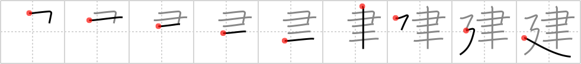

# {建}

## `build`

## Strokes: 9

## Reading:

### On-Yomi: ケン、コン &mdash; Kun-Yomi: た.てる、た.て、-だ.て、た.つ

### Examples: 建築 (けんちく), 建議 (けんぎ), 封建的 (ほうけんてき), 建つ (た.つ), 建てる (た.てる)

## Words:

再建(さいけん): rebuilding, reconstruction, rehabilitation

建前(たてまえ): face, official stance, public position or attitude (as opposed to private thoughts)

封建(ほうけん): feudalistic

建設(けんせつ): construction, establishment

建築(けんちく): construction, architecture

建つ(たつ): build, erect

建てる(たてる): build

建物(たてもの): building
