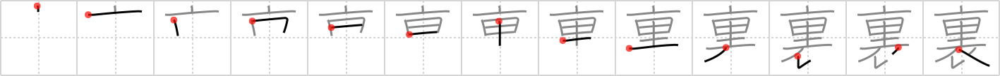

# {裏}

## `back`

## Strokes: 13

## Reading:

### On-Yomi: リ &mdash; Kun-Yomi: うら

### Examples: 裏 (うら)

## Words:

裏返し(うらがえし): inside out, upside down

裏返す(うらがえす): turn inside out, turn the other way, turn over

裏切る(うらぎる): betray, double-cross

裏口(うらぐち): back door, rear entrance

裏(うら): the back, the wrong side
