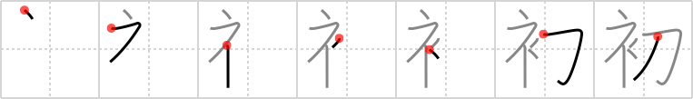

# {初}

## `first time`

## Strokes: 7

## Reading:

### On-Yomi: ショ &mdash; Kun-Yomi: はじ.め、はじ.めて、はつ、はつ-、うい-、-そ.める、-ぞ.め

### Examples: 初 (うい), 初める (そ.める), 初め (はじ.め), 初めて (はじ.めて), 初 (はつ)

## Words:

初版(しょはん): first edition

初(はつ): first, new

初耳(はつみみ): something heard for the first time

初級(しょきゅう): elementary level

初旬(しょじゅん): first 10 days of the month

最初(さいしょ): first time

初めて(はじめて): for the first time

初めに(はじめに): in the beginning, at first
