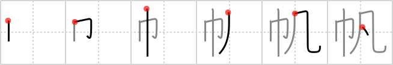

## `sail`

## [6]

## Reading:

### On-Yomi: ハン &mdash; Kun-Yomi: ほ

## Koohii stories:

1) [<a href="http://kanji.koohii.com/profile/gsantise">gsantise</a>] 28-8-2007(156): When stranded at sea, we needed a<strong> Sail</strong>. The best we had was a TOWEL, which was MEDICORE, only catching a DROP of WIND. 

2) [<a href="http://kanji.koohii.com/profile/mcbainpc">mcbainpc</a>] 25-6-2008(131): A towel makes a mediocre<strong> sail</strong>. 

3) [<a href="http://kanji.koohii.com/profile/nolusu">nolusu</a>] 16-7-2007(21): A<strong> sail</strong> is a piece of <em>cloth</em> used to catch every <em>drop of wind</em>. 

4) [<a href="http://kanji.koohii.com/profile/shadolite">shadolite</a>] 18-3-2008(7): One handy use for a towel, according to the <em>Hitch-Hiker&#039;s Guide to the Universe</em>, is as a<strong> sail</strong>. The effect will be mediocre, however, if there is little wind. 

5) [<a href="http://kanji.koohii.com/profile/stan_in_japan">stan_in_japan</a>] 13-2-2012(5): A <em>towel</em> makes a <em>mediocre</em><strong> sail</strong>. 

6) [<a href="http://kanji.koohii.com/profile/uchifly">uchifly</a>] 21-12-2009(4): In order to<strong> SAIL</strong> you need at least two things: A TOWEL and a BIT of WIND. 

7) [<a href="http://kanji.koohii.com/profile/Thomas86">Thomas86</a>] 4-4-2011(3): &quot;Get a proper<strong> sail</strong>! This <em>towel</em> is doing a very <em>mediocre</em> job.&quot;. 

8) [<a href="http://kanji.koohii.com/profile/izakaya27">izakaya27</a>] 1-3-2009(3): This is a <em>mediocre</em><strong> sail</strong> because it&#039;s made from a <em>towel</em>, but mediocre can be difficult to visualize, so imagine the <em>wind</em> billowing out the towel<strong> sail</strong>, and a <em>drop</em> of rain flying through the wind and hitting the middle of the towel<strong> sail</strong>. (wind + drop = mediocre). 

9) [<a href="http://kanji.koohii.com/profile/Ameyama">Ameyama</a>] 30-3-2008(3): Using a <strong>towel</strong> as part of a boat makes a <strong>mediocre</strong><strong> sail</strong>. 

10) [<a href="http://kanji.koohii.com/profile/jbudding">jbudding</a>] 25-10-2012(2): A ragged old <em>towel</em> makes a <em>mediocre</em><strong> SAIL</strong>. 
