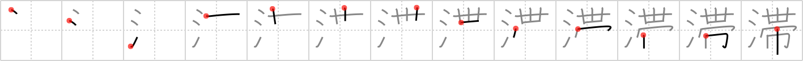

## `stagnate`

## [13]

## Reading:

### On-Yomi: タイ、テイ &mdash; Kun-Yomi: とどこお.る

## Heisig story:

People that have been &quot;<i>sashed</i>&quot; to something (whether their mother's apron strings or a particular job) for too long become like <i>water</i> that has stopped moving: they start to <b>stagnate</b>.

## Koohii stories:

1) [<a href="http://kanji.koohii.com/profile/ihatobu">ihatobu</a>] 1-12-2008(246): History of the first karate blackbelts: In those days, it was often difficult to find fresh, clean <em>water</em>, so samurai usually had to wash their <em>sashes</em> in <strong>stagnant</strong> puddles. The longer one had been studying martial arts, the older the sash on one&#039;s karate uniform and, therefore, the darker the color. So why weren&#039;t their karate uniforms black too? Never seen a ninja????

2) [<a href="http://kanji.koohii.com/profile/jwy2k2">jwy2k2</a>] 20-3-2007(72): A moat is a<strong> stagnate</strong> ring of water like an obi (sash) of water tied around the castle.

3) [<a href="http://kanji.koohii.com/profile/stringy_cow">stringy_cow</a>] 1-1-2009(46): WATER that is &quot;tied up&quot; as if with a SASH and unable to flow properly will become<strong> stagnate</strong>.

4) [<a href="http://kanji.koohii.com/profile/tomtosh">tomtosh</a>] 20-12-2007(46): This is one I keep missing, and always because of the right-hand side. I can easily associate<strong> stagnate</strong> with <em>water</em> but never with <em>sash.</em> And so I will now try to associate<strong> stagnate</strong> with something around the house that often<strong> stagnate</strong>s and smells awful: the kitchen <em>washrag</em>. From washrag, I will make the association with <em>sash</em>.

5) [<a href="http://kanji.koohii.com/profile/nesert">nesert</a>] 14-10-2009(41): The <em>water</em> became<strong> stagnate</strong> because the drain was clogged with a <em>sash</em>.

6) [<a href="http://kanji.koohii.com/profile/Cruger">Cruger</a>] 25-8-2008(18): If you <em>wash</em> your <em>sash</em> your level in karate will<strong> stagnate</strong>. (From Black belt --&gt; White belt).

7) [<a href="http://kanji.koohii.com/profile/dwhitman">dwhitman</a>] 15-10-2007(11): In the past, it was hard to find fresh, clean water, so samurai had to wash their sashes in <strong>stagnant</strong> puddles. The longer one studied martial arts, the darker the sash&#039;s color from the <strong>stagnant</strong> water. When one reached the highest level of the art with nothing more to learn, their dark sash showed they were now <strong>stagnating</strong>. (This story has great mnemonic power, but remember that the keyword is the verb<strong> stagnate</strong>, not the adjective stagnant.) (tweaked version of ihatobu&#039;s).

8) [<a href="http://kanji.koohii.com/profile/jamestaverner">jamestaverner</a>] 10-2-2008(9): The <em>sash</em> is Mayor Quimby from The Simpsons. He is standing in front of a <strong>stagnant</strong> pool of <em>water</em> in Springfield telling everybody that it&#039;s no threat to public health.

9) [<a href="http://kanji.koohii.com/profile/howdycowdy">howdycowdy</a>] 11-3-2008(8): The phrase to be &quot;on the rag&quot; is gross but useful here. Imagine that in ancient Japan, because there were no tampons, women had to use their <em>sashes</em> to stop the menstual fluids (i.e. the <em>water</em>). This stoppage was, in effect, an attempt to<strong> STAGNATE</strong> the blood in one place rather than allowing it to run freely all over one&#039;s kimono.

10) [<a href="http://kanji.koohii.com/profile/hornlo">hornlo</a>] 21-9-2010(6): [ <strong>stagnate</strong> = <em>water</em> + <em>sash</em> ] - there was <strong>stagnate</strong> <em>water</em> in the tub because someone had dropped their <em>sash</em> in the drain.
