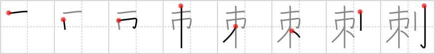

## `thorn`

## [8]

## Reading:

### On-Yomi: シ &mdash; Kun-Yomi: さ.す、さ.さる、さ.し、さし、とげ

## Koohii stories:

1) [<a href="http://kanji.koohii.com/profile/wazato">wazato</a>] 30-9-2007(166): A TREE with a BELT wrapped around the middle. If you tighten the BELT, hundreds of tiny SABERS pop out of the tree in all directions, looking like<strong> THORN</strong>S. 

2) [<a href="http://kanji.koohii.com/profile/ruuku35">ruuku35</a>] 7-9-2006(34): The BELT TREE has<strong> THORN</strong>S like SABERS. 

3) [<a href="http://kanji.koohii.com/profile/Sevenhelmets">Sevenhelmets</a>] 4-8-2008(24): The crown of <strong>thorn</strong>s on Christ was a <em>belt</em> from a <strong>thorn</strong> bush <em>tree</em>, and cut him like <em>sabers</em>. 

4) [<a href="http://kanji.koohii.com/profile/SammyB">SammyB</a>] 10-6-2008(16): The tree was covered with a <em>belt</em> of<strong> thorn</strong>s. They cut like a <em>sabre</em>! 

5) [<a href="http://kanji.koohii.com/profile/Yonosa">Yonosa</a>] 14-5-2009(13): The<strong> thorn</strong>s were wrapped around the tree like a belt of sabers. 

6) [<a href="http://kanji.koohii.com/profile/SketchySolid">SketchySolid</a>] 26-8-2009(11): Imagine a first-person fighting game. You are up against your next opponent:<strong> Thorn</strong>! He is a giant <em>tree</em> with a martial artist&#039;s black <em>belt</em> around his middle. To the right you see the huge <em>sabre</em> you a wielding, ready to strike him down. 

7) [<a href="http://kanji.koohii.com/profile/ihatobu">ihatobu</a>] 5-8-2007(11): Imagine a grainy black and white Kurosawa version of <em>The Lord of the Rings: The Two Towers</em>. Treebeard wears two giant<strong> thorn</strong>s on his belt, just like a samurai. 

8) [<a href="http://kanji.koohii.com/profile/dwhitman">dwhitman</a>] 14-10-2007(7): A vine with sword-like<strong> thorn</strong>s wraps around a tree like a belt. 

9) [<a href="http://kanji.koohii.com/profile/dorban">dorban</a>] 6-8-2012(4): <strong>Thorns</strong> sharp as <em>sabres</em> twist around the <em>tree</em> like a <em>belt</em>. 

10) [<a href="http://kanji.koohii.com/profile/Lazerbeat">Lazerbeat</a>] 20-7-2011(4): An ent with a BELT and a SABER is a<strong> thorn</strong> in Sarumans side. 
