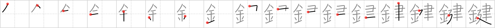

## `key`

## [17]

## Reading:

### On-Yomi: ケン &mdash; Kun-Yomi: かぎ

## Heisig story:

The <i>golden</i> <b>key</b> you have been presented by the mayor gives you access to all the <i style=&quot;font-weight: bold; &quot;>buildings</i>&nbsp;in the city.

## Koohii stories:

1) [<a href="http://kanji.koohii.com/profile/mantixen">mantixen</a>] 16-2-2007(99): The <em>metal</em> thing you need in order to enter things you <em>build</em> is a<strong> key</strong>.

2) [<a href="http://kanji.koohii.com/profile/kapalama">kapalama</a>] 5-11-2010(15): 鍵盤 <a href="../v4/2761">key</a> (#2761 鍵) ケン, かぎ ... Parts: 金 , 建 (cf 建物 <a href="../v4/391">build</a> (#391 建), 健康 <a href="../v4/974">healthy</a> (#974 健)) ... Story: The most important <em>Metal</em> in any <em>build</em>ing is the <strong>lock</strong> on the front door, and without a <strong>key</strong> you ain&#039;t getting in. This kanji means both lock and<strong> key</strong> to most Japanese people. 錠前 is technically the word for lock but it&#039;s not used in daily conversation.

3) [<a href="http://kanji.koohii.com/profile/francajun">francajun</a>] 15-4-2012(9): They use metal to build<strong> key</strong>s.

4) [<a href="http://kanji.koohii.com/profile/jusenkyoguide">jusenkyoguide</a>] 10-11-2012(5): In Zelda, the <em>gold</em><strong> key</strong> will let you into any <em>building</em>.

5) [<a href="http://kanji.koohii.com/profile/ZxHIROxZ">ZxHIROxZ</a>] 26-6-2012(4): Many have tried and failed in seeking the<strong> key</strong> to El Dorado, the land of <em>golden buildings</em> (Imagine if El Dorado kept up with modern times).

6) [<a href="http://kanji.koohii.com/profile/FoxintheStars">FoxintheStars</a>] 13-8-2010(3): Any<strong> key</strong> can open a house, but the one you really want is the magic <em>golden</em><strong> key</strong> that will <em>build</em> the house!

7) [<a href="http://kanji.koohii.com/profile/Meconium">Meconium</a>] 3-12-2009(2): In Japan, the main material used to <em>build</em> things is wood; however, a small amount of <em>metal</em> is a<strong> key</strong> part of the structure. Plus, to enter the <em>build</em>ing, you need a <em>metal</em><strong> key</strong>.

8) [<a href="http://kanji.koohii.com/profile/melchan">melchan</a>] 15-9-2009(2): A<strong> key</strong> is a piece of <em>metal</em> you use to enter your apartment, which is in a <em>building</em>.

9) [<a href="http://kanji.koohii.com/profile/Qverner">Qverner</a>] 23-4-2013(1): <em>Gold</em> (money/financing) is the<strong> key</strong> if you want to <em>build</em> something.

10) [<a href="http://kanji.koohii.com/profile/dondonsj">dondonsj</a>] 28-11-2012(): The<strong> key</strong> building a building a lasting relationship is by giving her a golden ring.

### {V4: 2761, V6: 418}
