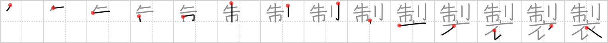

# {製}

## Strokes: 14

## Reading:

### On-Yomi: セイ

## Words:

製(せい): -made, make

製鉄(せいてつ): iron manufacture

製法(せいほう): manufacturing method, recipe, formula

作製(さくせい): manufacture

製作(せいさく): manufacture, production

製造(せいぞう): manufacture, production

製品(せいひん): manufactured goods
