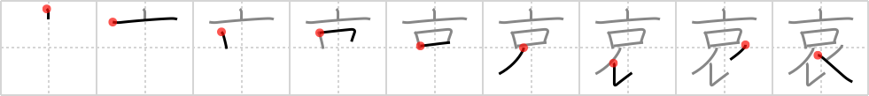

## `pathetic`

## [9]

## Reading:

### On-Yomi: アイ &mdash; Kun-Yomi: あわ.れ、あわ.れむ、かな.しい

## Heisig story:

A drunken sod in a tattered <i>top hat</i> and soiled silk <i>scarf</i> with a giant <i>mouth</i> guzzling something or other gives us a <b>pathetic</b> character role in which W. C. Fields might find himself right at home.

## Koohii stories:

1) [<a href="http://kanji.koohii.com/profile/Asgard">Asgard</a>] 28-8-2006(188): One of my friends with a crazy sense of fashion loves to wear a <em>tophat</em> and a <em>scarf</em> so that you can&#039;t see his whole face but only his <em>mouth</em>. He thinks it&#039;s cool. I think it&#039;s<strong> pathetic</strong>.

2) [<a href="http://kanji.koohii.com/profile/ihatobu">ihatobu</a>] 9-8-2007(76): A poor, homeless child like Oliver Twist, with a hungry open mouth, is<strong> pathetic</strong>-- in the original sense of the noun &quot;pathos.&quot; The tattered <em>tophat and scarf</em> he wears only adds to the pathos.

3) [<a href="http://kanji.koohii.com/profile/jwy2k2">jwy2k2</a>] 20-3-2007(36): Other definitions include grief, sorrow, pathos, pity, and sympathize. IMO the english word<strong> pathetic</strong> is often used nowadays to mean a sort of &quot;contemptuous pity&quot; but I think we need a more compasionate definition to understand 哀 , now and especially later when it starts being combined with other words...So, here&#039;s the top part of frame 308 享 (receive) but where the child was is now replaced by a scarf. Whatever fate befell the child is up to your imagination. grief, sorrow, pathos, sympathy,<strong> pathetic</strong>.

4) [<a href="http://kanji.koohii.com/profile/Zarxrax">Zarxrax</a>] 8-4-2008(27): That <em>tall</em> guy with the <em>scarf</em> is just so<strong> pathetic</strong>! (I can&#039;t help but see &quot;tall&quot; when I look at this kanji).

5) [<a href="http://kanji.koohii.com/profile/DeadLugosi">DeadLugosi</a>] 26-8-2008(13): A hat, a mouth and a cloak, I think that&#039;s all that beggar owns. How<strong> pathetic</strong>!

6) [<a href="http://kanji.koohii.com/profile/icamonkey">icamonkey</a>] 19-12-2009(7): The<strong> pathetic</strong> tall kid hangs himself with his scarf.

7) [<a href="http://kanji.koohii.com/profile/Nandaro">Nandaro</a>] 11-8-2009(7): You look pretty<strong> pathetic</strong> in just a top hat and a scarf.

8) [<a href="http://kanji.koohii.com/profile/vanilla_l">vanilla_l</a>] 1-6-2010(6): The <em>tall</em> man outside in the winter, naked except for a <em>scarf</em>, looks pretty<strong> pathetic</strong>.

9) [<a href="http://kanji.koohii.com/profile/garrettwarshaw">garrettwarshaw</a>] 8-5-2011(5): Imagine the Monopoly guy after he&#039;s gone bankrupt. He&#039;s wearing his <em>top hat and scarf</em> (now in tatters) at the bar, <em>mouth</em> wide open, drinking himself into oblivion. How<strong> PATHETIC</strong>!!

10) [<a href="http://kanji.koohii.com/profile/mirco">mirco</a>] 19-5-2013(3): A<strong> pathetic</strong> old drunk, trying to look nice in a top hat and cloak, is still nothing more than a big mouth looking to guzzle some beers.
