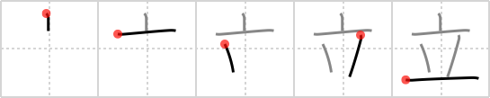

## `stand up`

## [5]

## Reading:

### On-Yomi: リツ、リュウ、リットル &mdash; Kun-Yomi: た.つ、-た.つ、た.ち-、た.てる、-た.てる、た.て-、たて-、-た.て、-だ.て、-だ.てる

## Heisig story:

This picture of a vase <b>standing up</b> has its meaning extended to represent the general posture of anything <b>standing up</b>.

## Koohii stories:

1) [<a href="http://kanji.koohii.com/profile/kitchen_sink">kitchen_sink</a>] 14-8-2007(88): A vase that can&#039;t<strong> stand up</strong> won&#039;t be a vase for long.

2) [<a href="http://kanji.koohii.com/profile/andrewlandry">andrewlandry</a>] 30-3-2009(26): This is a real<strong> stand up</strong> vase. It even wears a top hat!

3) [<a href="http://kanji.koohii.com/profile/DrWarrior12">DrWarrior12</a>] 2-9-2007(26): He was a<strong> stand up</strong> guy: he&#039;d lend you the top hat he wears everyday if you asked, and he will turn everything upside down to help you find your tools.

4) [<a href="http://kanji.koohii.com/profile/mezbup">mezbup</a>] 12-12-2008(13): <strong>Stand up</strong> a vase on a table and put a top hat on it and then represent it pictographically and there you have this kanji!

5) [<a href="http://kanji.koohii.com/profile/mantixen">mantixen</a>] 2-7-2009(8): If i&#039;m feeling <em>horn</em>y, I cover the area with my <em>top hat</em> when I<strong> stand up</strong>.

6) [<a href="http://kanji.koohii.com/profile/Nayelianne">Nayelianne</a>] 19-9-2008(4): To me it kinda looks like a child awkwardly trying to balance itself on its two feet on the floor so it can <strong>stand</strong>.

7) [<a href="http://kanji.koohii.com/profile/dihutenosa">dihutenosa</a>] 30-8-2007(4): Ever seen Grandma&#039;s Boy? Well, there&#039;s a scene where the grandmother picks up the dude&#039;s <strong>bong</strong>, thinking it&#039;s a <strong>vase</strong>. So for me from now on, the <strong>vase</strong> is a <strong>bong</strong>.

8) [<a href="http://kanji.koohii.com/profile/pudnakp">pudnakp</a>] 11-8-2011(3): Two guys are <strong>standing up</strong>, trying to keep the giant <em>top hat</em> from crushing them into the floor.

9) [<a href="http://kanji.koohii.com/profile/kanjidummy">kanjidummy</a>] 26-8-2010(3): A good vase will still<strong> stand up</strong> even when you throw a <em>top hat</em> on top.

10) [<a href="http://kanji.koohii.com/profile/Tornadic_Indignation">Tornadic_Indignation</a>] 29-4-2009(3): <strong>Stand up</strong> comedy is NOT funny if you&#039;re on stage naked wearing a <em>top hat</em> while <em>horn</em>y and rolling around the <em>floor</em> gazing at the audience with ardent passion.
