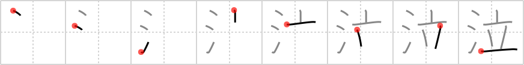

## `cry`

## [8]

## Reading:

### On-Yomi: キュウ &mdash; Kun-Yomi: な.く

### Examples: 泣く (な.く)

## Words:

泣く(なく): cry

## Koohii stories:

1) [<a href="http://kanji.koohii.com/profile/ruisu">ruisu</a>] 25-10-2007(104): Guys have two ways of watering when they are standing, the less common one is<strong> cry</strong>ing. 

2) [<a href="http://kanji.koohii.com/profile/AndamanIslander">AndamanIslander</a>] 1-2-2008(71): She <em>stood up</em> to leave the room when her eyes started to <em>water</em>... 

3) [<a href="http://kanji.koohii.com/profile/vxnine">vxnine</a>] 20-1-2009(36): This won&#039;t make sense for anyone who hasn&#039;t played the game, but for those who have, it&#039;ll make this character very easy to remember. Just picture that one scene in Final Fantasy VII where Cloud is <em>standing</em> in the <em>water</em> about to let Aeris go... A very sad scene which can make anyone<strong> cry</strong>. 

4) [<a href="http://kanji.koohii.com/profile/phauna">phauna</a>] 19-2-2008(28): I imagine Alice (in Wonderland) standing in a pool of her own making,<strong> cry</strong>ing to herself. 

5) [<a href="http://kanji.koohii.com/profile/salvw">salvw</a>] 17-12-2008(25): If you<strong> cry</strong> really hard you can fill up a vase with the water from your tears. 

6) [<a href="http://kanji.koohii.com/profile/uchifly">uchifly</a>] 23-12-2009(14): In ancient China, when men went to war, the women would collect their TEAR DROPS in a VASE, to show their husbands how much they CRIED for them. 

7) [<a href="http://kanji.koohii.com/profile/Doodsaq">Doodsaq</a>] 2-10-2007(8): I<strong> cry</strong> when i spill the bong water and get the weed wet. 

8) [<a href="http://kanji.koohii.com/profile/akemateiru">akemateiru</a>] 30-11-2010(7): Don&#039;t<strong> cry</strong> over water spilled from a vase. 

9) [<a href="http://kanji.koohii.com/profile/ragamufin">ragamufin</a>] 9-3-2013(4): I <strong>cried</strong> so much <em>water</em> I could fill a <em>vase</em>. 

10) [<a href="http://kanji.koohii.com/profile/barashkov">barashkov</a>] 8-2-2009(4): After I spilled some <em>WATER</em> she <em>STOOD UP</em> and left the room<strong> CRY</strong>ING. 
