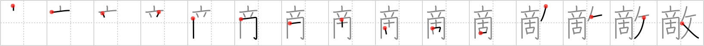

# {敵}

## Strokes: 15

## Reading:

### On-Yomi: テキ &mdash; Kun-Yomi: かたき、あだ、かな.う

### Examples: 敵 (かたき)

## Words:

敵(かたき): enemy, rival

素敵(すてき): lovely, dreamy, beautiful, great, fantastic, superb, cool, capital

匹敵(ひってき): comparing with, match, rival, equal

敵(てき): foe, enemy, rival
