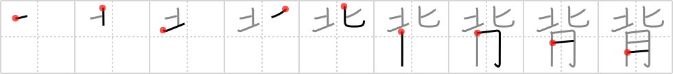

## `stature`

## [9]

## Reading:

### On-Yomi: ハイ &mdash; Kun-Yomi: せ、せい、そむ.く、そむ.ける

## Heisig V6:

One's <b>stature</b> is measured according to the &quot;<i>northern</i>-most&quot; <i>part of the body</i>.

## Koohii stories:

1) [<a href="http://kanji.koohii.com/profile/alantin">alantin</a>] 23-5-2007(144): While japanese people are generally small, people in the northern contryes have taller<strong> stature</strong> because of all the flesh they eat!

2) [<a href="http://kanji.koohii.com/profile/Danieru">Danieru</a>] 16-1-2008(68): Up in the Great White <em>North</em>, we eat a lot of <em>meat</em> - thus giving us great<strong> STATURE</strong>. Mmmm.... baby seals.

3) [<a href="http://kanji.koohii.com/profile/blaked569">blaked569</a>] 5-6-2009(46): Peter <em>North</em> is well known for his<strong> stature</strong>. You know, the size of his <em>flesh</em>.

4) [<a href="http://kanji.koohii.com/profile/stringy_cow">stringy_cow</a>] 12-1-2009(38): <strong>Stature</strong>/height has to do with how far &quot;NORTH&quot;(upward?XD) your FLESH/BODY goes.

5) [<a href="http://kanji.koohii.com/profile/vinniram">vinniram</a>] 20-12-2009(19): Your<strong> STATURE</strong> is measured from the <em>northern</em> most <em>part of your body</em>.

6) [<a href="http://kanji.koohii.com/profile/AndamanIslander">AndamanIslander</a>] 29-1-2008(16): <em>North</em>ern people (Swedes, Norwegians, etc.) are really <em>meat</em>y, just plain tall in <strong>stature</strong>.

7) [<a href="http://kanji.koohii.com/profile/mattoc_g">mattoc_g</a>] 24-4-2006(7): To gain<strong> stature</strong> in the north, you have to eat flesh.. (that&#039;s why Santa has such a high<strong> stature</strong>).

8) [<a href="http://kanji.koohii.com/profile/zardoz73">zardoz73</a>] 4-8-2008(6): Your<strong> stature</strong>, or height, is figured by measuring the NORTHERN most, or highest, BODY PART. Your head, of course, silly!

9) [<a href="http://kanji.koohii.com/profile/jabberwockychortles">jabberwockychortles</a>] 23-5-2009(5): The <em>north</em>ernmost part of the <em>flesh</em> determines one&#039;s<strong> stature</strong>.

10) [<a href="http://kanji.koohii.com/profile/gibler">gibler</a>] 7-7-2012(4): stature/height is back to back comparing the flesh 背が高い セ 背景 はいけい　－　Ｂａｃｋｇｒｏｕｎｄ.
