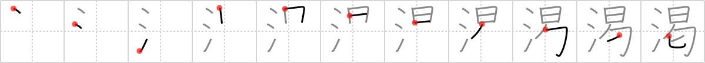

## `thirst`

## [11]

## Reading:

### On-Yomi: カツ &mdash; Kun-Yomi: かわ.く

## Koohii stories:

1) [<a href="http://kanji.koohii.com/profile/wazzab">wazzab</a>] 10-3-2007(133): You awaken from your <em>siesta</em> because you feel extremely <strong>thirst</strong>y so you go looking for some <em>water</em>. 

2) [<a href="http://kanji.koohii.com/profile/onsen_monkey">onsen_monkey</a>] 23-9-2006(72): The muchacho taking his SIESTA cries out that he is<strong> THIRST</strong>Y. So you pull out a bottle of WATER and pretend you&#039;re going to give it to him...but then you dump it all on the ground before his eyes. HAHA, sucked in muchacho!! 

3) [<a href="http://kanji.koohii.com/profile/Istvan">Istvan</a>] 13-6-2007(36): This whole series is easy to me if you picture Cheech as the man taking the Siesta. &quot;He man, you gotta drinka water man? I am like so<strong> thirst</strong>y I could die man.&quot;. 

4) [<a href="http://kanji.koohii.com/profile/chibilchan">chibilchan</a>] 1-9-2009(22): If anyone is having difficulty creating stories with the primitive <em>siesta</em>, try changing it to <em>beggar</em> - a <em>beggar</em> sits in his box begging for food/money under a hot sun. I have used <em>beggar</em> as a primitive in several frames and it works like a charm. Here a <em>beggar</em> develops a deep<strong> thirst</strong> for <em>water</em> as he crouches in his box under the hot sun. 

5) [<a href="http://kanji.koohii.com/profile/Bullwhip">Bullwhip</a>] 5-6-2008(18): Have some <em>water</em> before you take a <em>siesta</em>, or you will wake up<strong> thirst</strong>y! 

6) [<a href="http://kanji.koohii.com/profile/eri401">eri401</a>] 26-2-2010(9): When speaking words to the sleeping people, you are addressing an <a href="../452">audience</a> (#452 <a href="http://jisho.org/kanji/details/謁">謁</a>). When you&#039;ve spoken and your words devolve into a scratchy dry mouth, you&#039;re just <a href="../454">hoarse</a> (#454 <a href="http://jisho.org/kanji/details/喝">喝</a>). When he wishes to replace that hoarse mouth with water, it means he is<strong> thirst</strong>y -- <a href="../451">thirst</a> (#451 <a href="http://jisho.org/kanji/details/渇">渇</a>). And when its just his fingers, he&#039;ll <a href="../673">put up (a notice)</a> (#673 <a href="http://jisho.org/kanji/details/掲">掲</a>) to be QUIET!   <a href="http://jisho.org/kanji/details/渇水">渇水</a>  　= かっすい = drought.   <a href="http://jisho.org/kanji/details/渇望">渇望</a>   = かつぼう = craving; longing;<strong> thirst</strong>ing. 

7) [<a href="http://kanji.koohii.com/profile/Stevieman">Stevieman</a>] 19-3-2010(6): If you break up SIESTA into <em>tongue wagging in mouth</em>, <em>bound up</em>, <em>sitting man</em>, you have somewhat the image of a prisoner begging. This gives you the general sense of <em>BEGGAR</em>. Using <em>BEGGAR</em> as a primitive is better I think. A<strong> thirst</strong>y <em>BEGGAR</em> begs for <em>WATER</em>. A beggar speaks requesting an <a href="../452">audience</a> (#452 <a href="http://jisho.org/kanji/details/謁">謁</a>)(to beg for money), a beggar&#039;s garments are usually <a href="../453">brown</a> (#453 <a href="http://jisho.org/kanji/details/褐">褐</a>)(dirty), and beggars sleep so much when they open their mouth, their voice is <a href="../454">hoarse</a> (#454 <a href="http://jisho.org/kanji/details/喝">喝</a>). (btw, chinese etymology: the bottom part of siesta means to beg). 

8) [<a href="http://kanji.koohii.com/profile/Ameyama">Ameyama</a>] 17-4-2008(4): I<strong> thirst</strong> for water during a siesta, and vodka during a fiesta ;). 

9) [<a href="http://kanji.koohii.com/profile/winningless">winningless</a>] 22-10-2012(3): Rather than siesta. I&#039;m using hostage as my primitive. (under a hot sun, bound up and blindfolded, a person is forced to sit). Here, the flow of water is limited and the hostage must deal with agonizing<strong> thirst</strong>. 

10) [<a href="http://kanji.koohii.com/profile/Lazerbeat">Lazerbeat</a>] 6-7-2011(3): If you are<strong> thirst</strong>y, drink WATER after your SIESTA. 
