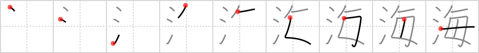

## `sea`

## [9]

## Reading:

### On-Yomi: カイ &mdash; Kun-Yomi: うみ

## Koohii stories:

1) [<a href="http://kanji.koohii.com/profile/Codexus">Codexus</a>] 6-12-2007(184): <em>Every</em> drop of <em>water</em> will eventually return to the<strong> sea</strong>. 

2) [<a href="http://kanji.koohii.com/profile/ihatobu">ihatobu</a>] 9-8-2008(22): As depicted in the classic SF film <em>Fantastic Voyage</em>, every drop of water is a<strong> sea</strong>, if you look close enough. Imagine peering through a microscope at a vast<strong> sea</strong> teeming with microbial life (and perhaps a minaturized submarine). <strong>Note:</strong> Take care not to confuse with <a href="../549">ocean</a> (#549 <a href="http://jisho.org/kanji/details/洋">洋</a>). 

3) [<a href="http://kanji.koohii.com/profile/Ceryn">Ceryn</a>] 24-3-2008(17): &quot;WATER, WATER, EVERYwhere, And all the boards did shrink; WATER, WATER, EVERYwhere, Nor any drop to drink.&quot; Remember to take enough water with you when you go out to<strong> SEA</strong> or die like the sailors in The Rime of the Ancient Mariner. 

4) [<a href="http://kanji.koohii.com/profile/kiisu">kiisu</a>] 28-2-2008(16): There is water in every<strong> sea</strong>. 

5) [<a href="http://kanji.koohii.com/profile/wasurenaide">wasurenaide</a>] 8-8-2007(11): My way of distinguishing this from <a href="../549">ocean</a> (#549 <a href="http://jisho.org/kanji/details/洋">洋</a>)   <a href="http://jisho.org/kanji/details/海">海</a>  -うみ rhymes with<strong> sea</strong>   <a href="http://jisho.org/kanji/details/洋服">洋服</a>  -ようふく (first syllable) rhymes with (first syllable) ocean. 

6) [<a href="http://kanji.koohii.com/profile/nornagon">nornagon</a>] 10-6-2012(7): I confuse this with <a href="../138">open sea</a> (#138 <a href="http://jisho.org/kanji/details/沖">沖</a>), so to make it totally clear I imagine this as a closed<strong> sea</strong>, where <em>every</em> drop of <em>water</em> is accounted for, an has to get special permission from the closed<strong> sea</strong> authorities if it wants to leave. 

7) [<a href="http://kanji.koohii.com/profile/TunS77">TunS77</a>] 28-11-2009(7): Ahhhh!!! There&#039;s <em>water everywhere</em> (Aquaphobics opinion of the<strong> SEA</strong>). 

8) [<a href="http://kanji.koohii.com/profile/pm215">pm215</a>] 2-3-2008(5): Obviously this is a reference to the Ancient Mariner, who was lost at <strong>sea</strong> -- <em>water</em>, water <em>every</em>where, but not a drop to drink... 

9) [<a href="http://kanji.koohii.com/profile/kirkaking">kirkaking</a>] 9-5-2012(4): There is <em>water</em> in <em>every</em><strong> sea</strong>. 

10) [<a href="http://kanji.koohii.com/profile/terozen">terozen</a>] 25-3-2012(4): There is <em>water</em> in <em>every</em> <strong>sea</strong>. Anything else would be weird, right? 
