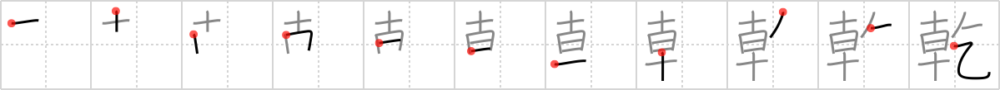

## `drought`

## [11]

## Reading:

### On-Yomi: カン、ケン &mdash; Kun-Yomi: かわ.く、かわ.かす、ほ.す、ひ.る、いぬい

## Heisig V6:

In times of <b>drought</b> anything at all will do. Here we see the victims <i>begging</i> for just a little <i>mist</i> for relief.

## Koohii stories:

1) [<a href="http://kanji.koohii.com/profile/dingomick">dingomick</a>] 7-8-2007(211): During a <strong>drought</strong>, everything <em>begs</em> for even a <em>mist</em> for relief.

2) [<a href="http://kanji.koohii.com/profile/TheMage">TheMage</a>] 11-10-2008(75): During a <strong>drought</strong>, even <em>mist</em> is <em>begged</em> for.

3) [<a href="http://kanji.koohii.com/profile/samuize">samuize</a>] 28-2-2007(56): Beggar has to drink mist because there is no water in the<strong> drought</strong>. I get this one confused with thirst 451 but try to remember that there is no water element beacuse it is a<strong> drought</strong>.

4) [<a href="http://kanji.koohii.com/profile/Filip">Filip</a>] 29-2-2008(23): The beggar is licking the ten sunflowers to get some moisture from the mist. Why? It has been a<strong> drought</strong>.

5) [<a href="http://kanji.koohii.com/profile/roderik">roderik</a>] 21-6-2008(13): <em>Ten sunflowers</em> <em>begged</em> the rain gods for even a drip of mist, for there had been a<strong> drought</strong>.

6) [<a href="http://kanji.koohii.com/profile/eri401">eri401</a>] 6-5-2011(9): Every morning (ten times <a href="../26">early</a> (#26 早)), I&#039;m thirsty and <a href="../462">beg</a> (#462 乞) for a beer. It feels like a<strong> drought</strong>!! Here comes the beer~! 乾杯 =　かんぱい = cheers!

7) [<a href="http://kanji.koohii.com/profile/torida">torida</a>] 26-5-2010(6): In times of<strong> drought</strong>, the <em>mist</em> they had <em>begged</em> so desperately for finally came, a sign that moisture was in the air... Note: there is no &#039;water&#039; element because there is a<strong> drought</strong>!

8) [<a href="http://kanji.koohii.com/profile/kakashi">kakashi</a>] 31-1-2011(5): When there&#039;s a<strong> drought</strong>, one doesn&#039;t care about his/her pride -- he/she will <em>beg</em> just for a light <em>mist</em> to water the crops. Don&#039;t confuse with <a href="../451">thirst</a> (#451 渇); this is to beg for water for various purposes. <a href="../451">thirst</a> (#451 渇) is the lazy sleeper who wants a drink.

9) [<a href="http://kanji.koohii.com/profile/Yuta73">Yuta73</a>] 6-1-2012(4): During a<strong> drought</strong>, you <em>beg</em> for the morning <em>mist</em> so as to be able to gather something to drink. Don&#039;t confuse with 渇 <a href="../451">thirst</a> (#451 渇).

10) [<a href="http://kanji.koohii.com/profile/flameiguana">flameiguana</a>] 30-8-2012(3): During the<strong> drought</strong>, even some <em>mist</em> is worth <em>beg</em>ging for.
