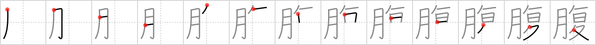

## `abdomen`

## [13]

## Reading:

### On-Yomi: フク &mdash; Kun-Yomi: はら

### Examples: 腹 (はら)

## Words:

お腹(おなか): stomach

空腹(くうふく): hunger

山腹(さんぷく): hillside, mountainside

中腹(ちゅうっぱら): irritated, offended

腹立ち(はらだち): anger

腹(はら): abdomen, belly, stomach

## Koohii stories:

1) [<a href="http://kanji.koohii.com/profile/KANJI">KANJI</a>] 28-11-2006(127): The only <strong>body</strong> part that <strong>doubles over</strong>. 

2) [<a href="http://kanji.koohii.com/profile/dihutenosa">dihutenosa</a>] 30-8-2007(66): Imagine getting punched in the<strong> abdomen</strong>, a fairly tender part of <em>flesh</em>, and instead of doubling forward, you <em>double back</em>. That would be pretty painful. 

3) [<a href="http://kanji.koohii.com/profile/elanlan">elanlan</a>] 17-6-2009(40): The <em>part of the body (flesh)</em> that is exercised when we lie down and bring our <em>walking legs</em> toward the <em>sun</em> is the<strong> abdomen</strong> (aka: leglifts). 

4) [<a href="http://kanji.koohii.com/profile/Ramchip">Ramchip</a>] 23-2-2007(19): Try not to confuse the primitive &#039;double back&#039; and <a href="../1130">fold</a> (#1130 <a href="http://jisho.org/kanji/details/折">折</a>). After I <em>backtracked</em> from a long day of hiking, my <strong>abdomen</strong> was hungry for <em>flesh</em>, so I ate a huge steak. 

5) [<a href="http://kanji.koohii.com/profile/kiisu">kiisu</a>] 3-3-2008(13): Well, flesh doubled over..and over .. think of the guts ...in the<strong> abdomen</strong>. 

6) [<a href="http://kanji.koohii.com/profile/ericshun">ericshun</a>] 20-2-2007(13): Situps. 

7) [<a href="http://kanji.koohii.com/profile/shadolite">shadolite</a>] 20-3-2008(12): The part of the body that hurts so bad during the menstrual cycle is usually the<strong> abdomen</strong>. In some cases, the pain can be so bad that one doubles over in agony. 

8) [<a href="http://kanji.koohii.com/profile/fjolnir">fjolnir</a>] 10-1-2010(8): If your <em>body</em> had a <em>double back</em> there would be no<strong> abdomen</strong>. 

9) [<a href="http://kanji.koohii.com/profile/mcmike2099">mcmike2099</a>] 15-6-2009(7): The<strong> abdomen</strong> is one of the most difficult <strong>BODY</strong> parts to work out. To improve your abs you have to do a lot of crunches. Each time, just as you reach the bottom, you have to <strong>DOUBLE BACK</strong> and use your<strong> abdomen</strong> to push yourself up again. (Remember, to <em>double back</em> is to <strong>lie down</strong> after a long <strong>day</strong> on your <strong>walking legs</strong>). 

10) [<a href="http://kanji.koohii.com/profile/jbudding">jbudding</a>] 27-10-2012(6): After starting my walk, a growling in my<strong> ABDOMEN</strong> made me <em>double back</em>, for food to feed my <em>flesh</em>. 
