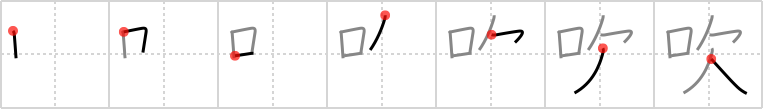

# {吹}

## `blow`

## Strokes: 7

## Reading:

### On-Yomi: スイ &mdash; Kun-Yomi: ふ.く

### Examples: 吹く (ふ.く)

## Words:

吹奏(すいそう): playing wind instruments

吹雪(ふぶき): snow storm

吹く(ふく): blow (wind, etc.), emit
