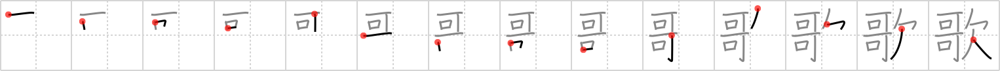

## `song`

## [14]

## Reading:

### On-Yomi: カ &mdash; Kun-Yomi: うた、うた.う

## Koohii stories:

1) [<a href="http://kanji.koohii.com/profile/Ameyama">Ameyama</a>] 4-4-2008(138): <strong>Can-Can</strong>-ers <strong>lack</strong> the ability to sing a <strong>song</strong>, so they just dance. 

2) [<a href="http://kanji.koohii.com/profile/dingomick">dingomick</a>] 17-12-2006(64): <em>Can-can</em> dancers are supposed to be big-bosomed girls who dance. Yet these so called can-can dancers are flat-chested and singing a<strong> song</strong>, so audience of men is <em>yawn</em>ing in boredom. 

3) [<a href="http://kanji.koohii.com/profile/Peppi">Peppi</a>] 5-6-2009(38): Do you know the &quot;Obama<strong> song</strong>&quot;? It goes like: &quot;Yes we <em>can</em>, yes we <em>can</em>!&quot; The problem is, the lyrics repeat so often that everybody starts <em>yawning</em> sooner or later. - This is no political comment ;-). 

4) [<a href="http://kanji.koohii.com/profile/BigAmish">BigAmish</a>] 15-8-2008(36): Modern<strong> SONG</strong>stresses have <em>doubly-nice CANs</em>, but <em>LACK</em> true musical talent. 

5) [<a href="http://kanji.koohii.com/profile/kaeru">kaeru</a>] 7-11-2008(18): The Idol contestants think &quot;I CAN I CAN SING THIS<strong> SONG</strong>&quot; but most of them LACK talent. 

6) [<a href="http://kanji.koohii.com/profile/nath04">nath04</a>] 30-8-2009(10): The <em>toucan</em> (two can) bird <em>lacks</em> the ability to sing a<strong> song</strong> .. but they can <em>yawn</em>! 

7) [<a href="http://kanji.koohii.com/profile/Yuta73">Yuta73</a>] 21-12-2011(9): The <em>can-can</em> girls are dancing and singing a<strong> song</strong>. Look, they <em>lack</em> their panties!. Don&#039;t confuse with   <a href="http://jisho.org/kanji/details/唱">唱</a>   <a href="../21">chant</a> (#21 <a href="http://jisho.org/kanji/details/唱">唱</a>). RTK2: カ、うた(song)、うたう(sing). 

8) [<a href="http://kanji.koohii.com/profile/philosophicalcat">philosophicalcat</a>] 3-1-2012(5): <strong>SONG</strong>: <em>Can/can + lack</em>. In karaoke, after several drinks, most people think &quot;I <em>can</em> sing, I <em>can</em> sing&quot; but most of them <em>lack</em> talent. 

9) [<a href="http://kanji.koohii.com/profile/shirish">shirish</a>] 3-2-2009(5): It&#039;s a<strong> song</strong> sung by <em>can-can</em> girls, who cares if it <em>lacks</em> true music. 

10) [<a href="http://kanji.koohii.com/profile/Wosret">Wosret</a>] 28-5-2008(5): No<strong> song</strong> is lacking when sung by the can-can girls! 
