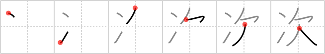

# {次}

## `next`

## Strokes: 6

## Reading:

### On-Yomi: ジ、シ &mdash; Kun-Yomi: つ.ぐ、つぎ

### Examples: 次回 (じかい), 次元 (じげん), 目次 (もくじ), 次ぐ (つ.ぐ), 次 (つぎ)

## Words:

次(し): order, sequence, times, next, below

次いで(ついで): next, secondly, subsequently

取り次ぐ(とりつぐ): to act as an agent for, to announce (someone), to convey (a message)

次第(しだい): order, precedence, circumstances, immediate(ly), as soon as, dependent upon

次々(つぎつぎ): in succession, one by one

次ぐ(つぐ): rank next to, come after

目次(もくじ): table of contents

次(つぎ): next, stage station, stage, subsequent
