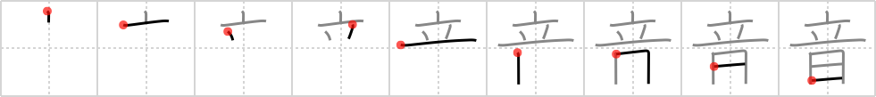

## `sound`

## [9]

## Reading:

### On-Yomi: オン、イン、ノン &mdash; Kun-Yomi: おと、ね

## Heisig V6:

The kanji for <b>sound</b> depicts something <i>standing</i> in the air over a <i>tongue wagging in a mouth</i>, much the same as a <b>sound</b> does for the briefest of moments before disappearing.

## Koohii stories:

1) [<a href="http://kanji.koohii.com/profile/Aploosh">Aploosh</a>] 23-8-2007(201): If you were standing on the sun, believe me, you&#039;d be making<strong> sound</strong>.

2) [<a href="http://kanji.koohii.com/profile/HMiettinen">HMiettinen</a>] 21-10-2007(75): The <em>tongue wagging in a mouth</em> produces a very high-pitched <strong>sound</strong>, breaking a nearby <em>vase</em>.

3) [<a href="http://kanji.koohii.com/profile/wazato">wazato</a>] 1-10-2007(62): Imagine the<strong> SOUND</strong>s a woman makes as she is STANDing above a WAGGING TOUNGE.

4) [<a href="http://kanji.koohii.com/profile/astgtciv">astgtciv</a>] 23-12-2006(27): Note that<strong> sound</strong> is very close to the <strong>muzzle</strong> primitive (it has the <em>sun</em> instead of the <em>mouth</em> at the bottom) - but in meaning they are precisely opposite!

5) [<a href="http://kanji.koohii.com/profile/romanrozhok">romanrozhok</a>] 16-6-2008(21): I STAND UP every DAY to the<strong> SOUND</strong> of [insert<strong> sound</strong> here].

6) [<a href="http://kanji.koohii.com/profile/sethg">sethg</a>] 23-2-2009(15): Every <em>day</em> the<strong> sound</strong> of my alarm clock gets me to <em>stand up</em> and a take a shower.

7) [<a href="http://kanji.koohii.com/profile/quety101">quety101</a>] 13-7-2009(11): A muzzle with a line cut in will let the<strong> sound</strong> out.

8) [<a href="http://kanji.koohii.com/profile/akahige">akahige</a>] 3-1-2009(6): A joke from the 80s comedian The Unknown Comic: &quot;Here&#039;s my impression of the first man to stand on the sun....OW! OH! DAMN! CRAP! OOH! OH!...&quot;.

9) [<a href="http://kanji.koohii.com/profile/guidedog">guidedog</a>] 10-5-2007(6): Standing wave =<strong> sound</strong>.

10) [<a href="http://kanji.koohii.com/profile/hornlo">hornlo</a>] 28-5-2011(5): [ <strong>sound</strong> = <em>stand up</em> / <em>day</em> ] - at the <strong>sound</strong> of reveille, <em>stand up</em> and start (standing on) the new <em>day</em> [cf muzzle primitive] : (<em>a<strong> sound</strong></em>, <em>sound concept</em>).
