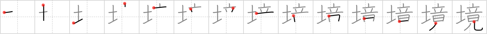

# {境}

## Strokes: 14

## Reading:

### On-Yomi: キョウ、ケイ &mdash; Kun-Yomi: さかい

### Examples: 境界 (きょうかい), 境地 (きょうち), 逆境 (ぎゃっきょう), 境 (さかい)

## Words:

境遇(きょうぐう): environment, circumstances

国境(くにざかい): national or state border

環境(かんきょう): environment, circumstance

境界(きょうかい): boundary

国境(こっきょう): national or state border

境(さかい): border, boundary, mental state
