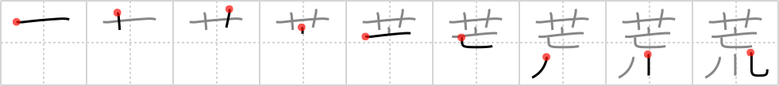

## {488}

## `laid waste`

## [9]

## Reading:

### On-Yomi: コウ &mdash; Kun-Yomi: あら.い、あら-、あ.れる、あ.らす、-あ.らし、すさ.む

### Examples: 荒らす (あ.らす), 荒れる (あ.れる), 荒い (あら.い)

## Words:

荒らす(あらす): to lay waste, to devastate, to damage, to invade, to break into

荒っぽい(あらっぽい): rough, rude

荒廃(こうはい): ruin

荒い(あらい): rough, rude, wild
