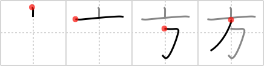

# {方}

## Strokes: 4

## Reading:

### On-Yomi: ホウ &mdash; Kun-Yomi: かた、-かた、-がた

### Examples: 方 (かた)

## Words:

彼方此方(あちこち): here and there

彼方(あちら): there, yonder, that

彼方此方(あちらこちら): here and there

遠方(えんぽう): long way, distant place

大方(おおかた): perhaps, almost all, majority

方(かた): polite way of indicating person

地方(じかた): area, locality, district, region, the coast

其方(そちら): over there, the other

外方(そっぽ): look (or turn) the other way

立方(たちかた): dancing (geisha)

他方(たほう): another side, different direction, (on) the other hand

何方(どちら): which, who

平方(へいほう): square (e.g. metre), square

方(ほう): side

方策(ほうさく): plan, policy

方式(ほうしき): form, method, system

見方(みかた): viewpoint

目方(めかた): weight

明け方(あけがた): dawn

一方(いっぽう): one side, one way, one direction, one party, the other party, on the other hand, meanwhile, only, simple, in turn

方々(かたがた): persons, all people, this and that, here and there, everywhere, any way, all sides

正方形(せいほうけい): square

地方(ちほう): area, locality, district, region, the coast

長方形(ちょうほうけい): rectangle, oblong

方角(ほうがく): direction, way, compass point

方言(ほうげん): dialect

方向(ほうこう): direction, course, way

方針(ほうしん): objective, plan, policy

方程式(ほうていしき): equation

方法(ほうほう): method, process, manner, way, means, technique

方々(ほうぼう): persons, this and that, here and there, everywhere, any way, all sides, all people

方面(ほうめん): direction, district, field (of study)

味方(みかた): friend, ally, supporter

仕方(しかた): method, way

両方(りょうほう): both

夕方(ゆうがた): evening
