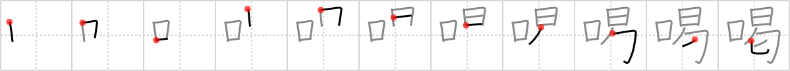

## `hoarse`

## [11]

## Reading:

### On-Yomi: カツ

## Heisig story:

When the muchacho on <i>siesta</i> looks up at you and opens his <i>mouth</i> to talk, his voice is so <b>hoarse</b> that you cannot understand him.

## Koohii stories:

1) [<a href="http://kanji.koohii.com/profile/Francois">Francois</a>] 1-4-2008(185): If you have a <em>siesta</em> with your <em>mouth</em>open, you will wake up with a<strong> hoarse</strong> voice.

2) [<a href="http://kanji.koohii.com/profile/nolusu">nolusu</a>] 17-7-2007(27): After taking a siesta, you find that your mouth is<strong> hoarse</strong> (after all you ARE thirsty remember).

3) [<a href="http://kanji.koohii.com/profile/zodiac">zodiac</a>] 31-10-2008(25): When you are<strong> hoarse</strong>, it&#039;s time for your <em>mouth</em> to have a <em>siesta</em>. (I don&#039;t like relating this to thirst, mixed them up a few times).

4) [<a href="http://kanji.koohii.com/profile/Istvan">Istvan</a>] 13-6-2007(10): Cheech&#039;s voice is always<strong> hoarse</strong>. Cheech, &quot;Hey man you seen what happened to my mouth man? I can&#039;t talk right man.&quot;.

5) [<a href="http://kanji.koohii.com/profile/Stevieman">Stevieman</a>] 19-3-2010(9): If you break up SIESTA into <em>tongue wagging in mouth</em>, <em>bound up</em>, <em>sitting man</em>, you have somewhat the image of a prisoner begging. This gives you the general sense of <em>BEGGAR</em>. Using <em>BEGGAR</em> as a primitive is better I think. A <a href="../451">thirst</a> (#451 渇) beggar begs for water. A beggar speaks requesting an <a href="../452">audience</a> (#452 謁)(to beg for money), a beggar&#039;s garments are usually <a href="../453">brown</a> (#453 褐)(dirty), and <em>BEGGARS SLEEP</em> so much when they open their <em>MOUTH</em>, their voice is<strong> hoarse</strong>. (btw, chinese etymology: the bottom part of siesta means to beg).

6) [<a href="http://kanji.koohii.com/profile/zardoz73">zardoz73</a>] 12-8-2008(8): The hombre has a<strong> hoarse</strong> throat. He fell asleep out in the hot sun and his MOUTH was open. All that hot dust blew in his MOUTH while he was asleep during his daily SIESTA. Madre puta!

7) [<a href="http://kanji.koohii.com/profile/eri401">eri401</a>] 3-9-2009(5): When speaking words to the sleeping people, you are addressing an <a href="../452">audience</a> (#452 謁). When you&#039;ve spoken and your words devolve into a scratchy dry mouth, you&#039;re just <a href="../454">hoarse</a> (#454 喝). When he wishes to replace that<strong> hoarse</strong> mouth with water, it means he is thirsty -- <a href="../451">thirst</a> (#451 渇). And when its just his fingers, he&#039;ll <a href="../673">put up (a notice)</a> (#673 掲) to be QUIET! 威喝 = いかつ = threatening.

8) [<a href="http://kanji.koohii.com/profile/fjolnir">fjolnir</a>] 10-1-2010(4): If you have your <em>mouth</em> open when you take your <em>siesta</em> you&#039;ll wake up all<strong> hoarse</strong>.

9) [<a href="http://kanji.koohii.com/profile/tstuhldreher">tstuhldreher</a>] 5-1-2009(3): If you have a siesta with your mouth open, you will wake up with a<strong> hoarse</strong> voice.

10) [<a href="http://kanji.koohii.com/profile/kirkaking">kirkaking</a>] 8-5-2012(2): If you have your <em>mouth</em> open during your <em>siesta</em>, you will wake up with a<strong> hoarse</strong> voice.
