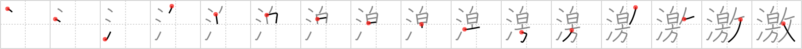

## {497}

## `violent`

## [16]

## Reading:

### On-Yomi: ゲキ &mdash; Kun-Yomi: はげ.しい

### Examples: 激しい (はげ.しい)

## Words:

激励(げきれい): encouragement

感激(かんげき): deep emotion, impression, inspiration

急激(きゅうげき): sudden, precipitous, radical

激増(げきぞう): sudden increase

刺激(しげき): stimulus, impetus, incentive, excitement, irritation, encouragement, motivation

激しい(はげしい): violent, vehement, intense, furious, tempestuous
