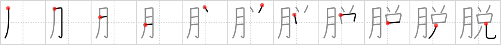

# {脱}

## `undress`

## Strokes: 11

## Reading:

### On-Yomi: ダツ &mdash; Kun-Yomi: ぬ.ぐ、ぬ.げる

### Examples: 脱ぐ (ぬ.ぐ), 脱げる (ぬ.げる)

## Words:

脱出(だっしゅつ): escape

脱する(だっする): to escape from, to get out

脱退(だったい): secession

脱線(だっせん): derailment, digression

脱ぐ(ぬぐ): take off clothes
