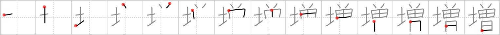

## `increase`

## [14]

## Reading:

### On-Yomi: ゾウ &mdash; Kun-Yomi: ま.す、ま.し、ふ.える、ふ.やす

## Heisig story:

This kanji depicts an <b>increase</b> of <i>soil</i>, multiplying so fast that it literally buries everything in its path.

## Koohii stories:

1) [<a href="http://kanji.koohii.com/profile/sannomiya">sannomiya</a>] 20-5-2007(268): Prices always<strong> INCREASE</strong> for LAND that was FORMERLY cheaper.

2) [<a href="http://kanji.koohii.com/profile/submacrolize">submacrolize</a>] 16-4-2008(32): Farmers work the <strong>land</strong> so they can<strong> INCREASE</strong> their <strong>formerly</strong> puny crop supply.

3) [<a href="http://kanji.koohii.com/profile/atylmo">atylmo</a>] 3-10-2008(23): Lately, the artist formerly known as &quot;Formerly Known As Prince&quot;, if you can believe it, has become increasingly <em>dirt</em>ier in his songs.

4) [<a href="http://kanji.koohii.com/profile/cheechuan">cheechuan</a>] 22-11-2007(18): This land on which &quot;The Artist <em>Formerly</em> Known as Prince*&quot; built his house has<strong> increase</strong>d in value.

5) [<a href="http://kanji.koohii.com/profile/shimouma">shimouma</a>] 4-4-2008(11): Formerly there was lots of land for everyone. But as the world population<strong> increase</strong>s, your own piece of dirt is becoming more and more difficult to secure.

6) [<a href="http://kanji.koohii.com/profile/bendyarm">bendyarm</a>] 30-9-2007(10): To<strong> increase</strong> your resources, plant the <em>two grains of rice</em> in the <em>rice field</em>, and let the <em>sun</em> shine on it. This metaphor covers the <em>increase</em> primitive, which can be used to<strong> increase</strong> any quantity. For the kanji, we limit the<strong> increase</strong> to the literal meaning of increasing rice production from the <em>land</em> (although I&#039;m guessing we will have to turn this meaning back into a metaphor when this kanji is used in compounds...).

7) [<a href="http://kanji.koohii.com/profile/pmbeddall">pmbeddall</a>] 6-11-2007(7): Manhattan Island, <em>land</em> <em>formerly</em> owned by native people was purchased in 1626 and has since had a tremendous<strong> increase</strong> in value.

8) [<a href="http://kanji.koohii.com/profile/kanjihito">kanjihito</a>] 22-12-2010(6): The <em>grounds</em>, <em>formerly</em> almost worthless,<strong> increase</strong>d greatly in worth.

9) [<a href="http://kanji.koohii.com/profile/johngwk">johngwk</a>] 4-7-2010(5): <em>Land</em> that was FORMERLY cheap usually<strong> increase</strong>s in price.

10) [<a href="http://kanji.koohii.com/profile/wazzab">wazzab</a>] 7-9-2007(5): Bill Clinton (the former president) stood on a bit of soil to announce an<strong> increase</strong> in taxes.
