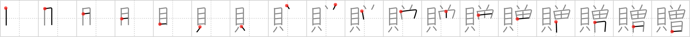

## `presents`

## [18]

## Reading:

### On-Yomi: ゾウ、ソウ &mdash; Kun-Yomi: おく.る

## Koohii stories:

1) [<a href="http://kanji.koohii.com/profile/ashman63">ashman63</a>] 3-6-2008(54): Imagine if the number of<strong> presents</strong> you get <em>increases</em> with each birthday. So on your first birthday, you receive just one <em>shell</em> as a <strong>present</strong>, but the next year it <em>increases</em> to two <em>shells</em> as<strong> presents</strong>, and so on, <em>increasing</em> and <em>increasing</em> so by the time you&#039;re elderly, the number of <em>shells</em> you&#039;ll get as<strong> presents</strong> will have <em>increased</em> to an awful lot of<strong> presents</strong>. GOT IT YET?<strong> PRESENTS</strong> = SHELLS + INCREASE. 

2) [<a href="http://kanji.koohii.com/profile/Viking101">Viking101</a>] 24-5-2009(29): The artist formerly known as Prince gave<strong> presents</strong> to all his fans. Picture him throwing live oysters into the audience as he performs. People are horrified and start gagging from the smell. 

3) [<a href="http://kanji.koohii.com/profile/uchifly">uchifly</a>] 28-12-2009(27): SEA SHELLS were FORMALLY great<strong> PRESENTS</strong>. Nowadays kids wants playstation and DS! 

4) [<a href="http://kanji.koohii.com/profile/Seiska">Seiska</a>] 17-2-2011(16): The money spent on<strong> presents</strong> increases every Christmas :/. 

5) [<a href="http://kanji.koohii.com/profile/neilhalligan">neilhalligan</a>] 12-1-2012(10): FORMERLY at Christmas I got<strong> PRESENTS</strong>, but now I just get MONEY. 

6) [<a href="http://kanji.koohii.com/profile/gsantise">gsantise</a>] 18-9-2007(7): Think regifting... You needed to make some<strong> presents</strong> for Christmas gifts but since your a broke student, you took what FORMERLY were SHELLFISH and made them into nice necklaces for<strong> PRESENTS</strong>. 

7) [<a href="http://kanji.koohii.com/profile/yawfosu88">yawfosu88</a>] 21-8-2007(5): Imagine being given a small <em>shellfish</em> as a Christmas present nicely wrapped up in a bright, big bow. You don&#039;t open it, but leave it in your living room. The next day your present is there, but an identical looking but larger version is next to it. Every time you leave the room the number of<strong> presents</strong> and their size doubles, then quadruples until, the number of<strong> presents</strong> has <em>increased </em>so much they are flowing out of the living room, into the kitchen and out of your windows. 

8) [<a href="http://kanji.koohii.com/profile/narafan">narafan</a>] 27-9-2007(4): You recieve an <em>increase</em> of <em>money</em> from the<strong> presents</strong> offered to you. 

9) [<a href="http://kanji.koohii.com/profile/ragamufin">ragamufin</a>] 12-3-2013(3): Your <em>money</em> will <em>increase</em> if you give<strong> presents</strong> to your boss ;)=). 

10) [<a href="http://kanji.koohii.com/profile/usis35">usis35</a>] 4-11-2011(3): Nowadays<strong> presents</strong> are INCREASINGLY being only MONEY . FORMERLY it was so different.... 
