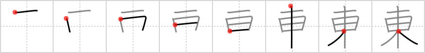

## {504}

## `east`

## [8]

## Reading:

### On-Yomi: トウ &mdash; Kun-Yomi: ひがし

### Examples: 東 (ひがし)

## Words:

東(あずま): east, Eastern Japan

関東(かんとう): Kantou (eastern half of Japan, including Tokyo)

東西(とうざい): East and West, Orient and Occident, whole country, Your attention, please!

東洋(とうよう): Orient

東(ひがし): east
