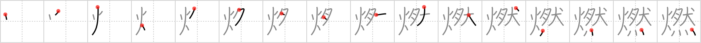

# {燃}

## `burn`

## Strokes: 16

## Reading:

### On-Yomi: ネン &mdash; Kun-Yomi: も.える、も.やす、も.す

### Examples: 燃える (も.える), 燃す (も.す), 燃やす (も.やす)

## Words:

燃焼(ねんしょう): burning, combustion

燃料(ねんりょう): fuel

燃える(もえる): to burn

燃やす(もやす): to burn
