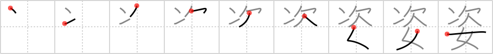

## `figure`

## [9]

## Reading:

### On-Yomi: シ &mdash; Kun-Yomi: すがた

## Heisig story:

This kanji depicts a <i>woman's</i> <b>figure</b> as a sort of <i>second</i> self.

## Koohii stories:

1) [<a href="http://kanji.koohii.com/profile/alantin">alantin</a>] 25-10-2007(212): The next woman always has a better<strong> figure</strong>! Thinking like that, you&#039;ll end up alone in an old folks home longing for the good old days!

2) [<a href="http://kanji.koohii.com/profile/elanlan">elanlan</a>] 30-1-2009(110): Whenever I am <em>next</em> to a <em>woman</em>, I can&#039;t help but take notice of her<strong> figure</strong>.

3) [<a href="http://kanji.koohii.com/profile/rachels">rachels</a>] 23-1-2009(47): The <em>next</em> <em>woman</em> always has a better<strong> figure</strong> ! Thinking like this is a burden weighing down many women. - (Thanks to alantin, but the last statement helps me get the placement right - it always used to be a problem with this kanji).

4) [<a href="http://kanji.koohii.com/profile/ew8049">ew8049</a>] 31-5-2006(40): First you see her<strong> FIGURE</strong>, NEXT you get to know the WOMAN behind the curves.

5) [<a href="http://kanji.koohii.com/profile/TwoGoats">TwoGoats</a>] 8-9-2009(12): When i am next to a woman, i imagine her<strong> figure</strong> under me =D.

6) [<a href="http://kanji.koohii.com/profile/ruuku35">ruuku35</a>] 24-1-2007(12): The<strong> figure</strong> of the next woman better be sexier!

7) [<a href="http://kanji.koohii.com/profile/uminohoshi">uminohoshi</a>] 3-5-2008(9): The WOMAN with the best<strong> figure</strong> will be America&#039;s NEXT top model.

8) [<a href="http://kanji.koohii.com/profile/Yonosa">Yonosa</a>] 14-5-2009(7): The next bitch i get is going to have a nice<strong> figure</strong>!

9) [<a href="http://kanji.koohii.com/profile/elhnad">elhnad</a>] 11-1-2008(7): Ashole judge keep calling NEXT in the women competition trying to find the best<strong> figure</strong>.

10) [<a href="http://kanji.koohii.com/profile/shinyclef">shinyclef</a>] 29-3-2009(6): The <em>next</em> <em>woman</em>&#039;s<strong> figure</strong> is always better. (My version of the grass is always greener on the other side.).
