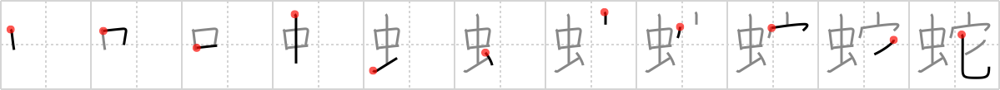

## `snake`

## [11]

## Reading:

### On-Yomi: ジャ、ダ、イ、ヤ &mdash; Kun-Yomi: へび

## Heisig V6:

Insect . . . house . . . spoon.

## Koohii stories:

1) [<a href="http://kanji.koohii.com/profile/nilfisq">nilfisq</a>] 22-8-2007(181): A<strong> snake</strong> eats <em>insects</em> and he does that outside, while we eat in the <em>house</em> and preferably with a <em>spoon</em>.

2) [<a href="http://kanji.koohii.com/profile/cheechuan">cheechuan</a>] 29-10-2007(101): I use a <em>spoon</em> to feed my pet-snake <em>insects</em> in the house.

3) [<a href="http://kanji.koohii.com/profile/potempkin">potempkin</a>] 12-9-2008(63): The Far Side cartoon: Picture a <strong>snake</strong> with glasses and a tie inside of his <em>house</em> in the morning. He&#039;s staring at the <em>spoon</em> next to his bowl full of <em>insects</em>. &quot;Dang!&quot; he mutters. (thanks to Cheesemaster64).

4) [<a href="http://kanji.koohii.com/profile/lifeflaw">lifeflaw</a>] 12-12-2008(28): My<strong> snake</strong> secretly eats <em>insects</em> outside the house, but in the <em>house</em>, he uses a <em>spoon</em> and follow etiquette! (adapted from nilfisq).

5) [<a href="http://kanji.koohii.com/profile/cingold">cingold</a>] 13-8-2009(16): Solid<strong> Snake</strong> gets into his <em>insect</em> camouflage ready to infiltrate the <em>house</em> - the insect suit doesn&#039;t allow weapons to be carried so he pilfers a <em>spoon</em> and takes out the Patriots within, getting out aliv...Snake?<strong> Snake</strong>? <strong>SNAAAAAAKEEEEE</strong>!

6) [<a href="http://kanji.koohii.com/profile/Cheesemaster64">Cheesemaster64</a>] 11-8-2008(14): Picture a<strong> snake</strong> with glasses and a tie drinking coffee inside of his house in the morning, pouring himself a bowl of insects instead of cereal.

7) [<a href="http://kanji.koohii.com/profile/marshallb">marshallb</a>] 8-11-2011(9): My <strong>snake</strong> is <em>house</em>-trained (he&#039;s a house-snake); he even eats his <em>insects</em> with a <em>spoon</em>.

8) [<a href="http://kanji.koohii.com/profile/astridtops">astridtops</a>] 11-10-2006(7): A<strong> snake</strong> is an animal that <em>sits on the ground</em> in your <em>house</em> and devours <em>insects</em>.

9) [<a href="http://kanji.koohii.com/profile/dvknoke">dvknoke</a>] 30-11-2011(6): <strong>Snake</strong>s like to snack on little <em>insects</em>. Imagine a<strong> snake</strong> sitting at the table in his little house, holding a <em>spoon</em> with his tail (like Lowly Worm in Busy Town), about to tuck into a bowl of fresh <em>insects</em> before him.

10) [<a href="http://kanji.koohii.com/profile/Aethelwulf">Aethelwulf</a>] 1-4-2013(5): The hard drinking<strong> snake</strong> kicks backs with some INSECTS in his HOUSE with a SPOON..
