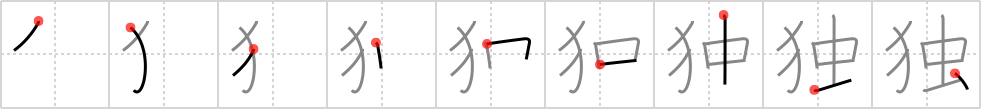

# {独}

## `single`

## Strokes: 9

## Reading:

### On-Yomi: ドク、トク &mdash; Kun-Yomi: ひと.り

### Examples: 独り (ひと.り)

## Words:

孤独(こどく): isolation, loneliness, solitude

単独(たんどく): sole, independence, single, solo (flight)

独裁(どくさい): dictatorship, despotism

独自(どくじ): original, peculiar, characteristic

独占(どくせん): monopoly

独創(どくそう): originality

独身(どくしん): bachelorhood, single, unmarried, celibate

独特(どくとく): peculiarity, uniqueness, characteristic

独立(どくりつ): independence, self-support

独り(ひとり): alone, unmarried

独り言(ひとりごと): soliloquy, monologue, speaking to oneself
