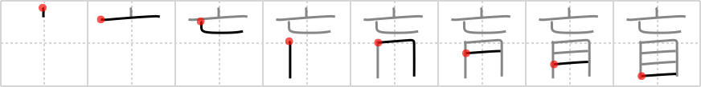

## `blind`

## [8]

## Reading:

### On-Yomi: モウ &mdash; Kun-Yomi: めくら

## Heisig story:

If one's <i>eyes perish</i> before death, one remains <b>blind</b> for the rest of life.

## Koohii stories:

1) [<a href="http://kanji.koohii.com/profile/narafan">narafan</a>] 18-7-2007(156): Deceased eyes! Easy ;).

2) [<a href="http://kanji.koohii.com/profile/tgray88">tgray88</a>] 4-10-2008(73): A person with <em>deceased</em> <em>eyes</em> is<strong> blind</strong>.

3) [<a href="http://kanji.koohii.com/profile/billyclyde">billyclyde</a>] 18-7-2007(18): Rather than &quot;dead eyes,&quot; break down DECEASED into TOPHAT and FISHHOOK, and picture each<strong> blind</strong> person&#039;s EYES as being unable to see because their eyes are covered with a TOP HAT, that&#039;s attached to a FISHHOOK stabbed in their eyeballs.

4) [<a href="http://kanji.koohii.com/profile/misha">misha</a>] 25-7-2007(10): I keep messing up the order of the primitives here. To emphasise the position, imagine the<strong> blind</strong> person wanting to take his <em>top hat</em> off the <em>hook</em>. Before he does that, though, he needs to re-attach his <em>eye</em>balls, which are rolling around on the floor.

5) [<a href="http://kanji.koohii.com/profile/crayonmaster">crayonmaster</a>] 8-2-2009(3): The<strong> blind</strong> man could not see anything with his EYES, but he claimed, when he looked up, he could see the DECEASED existing above.

6) [<a href="http://kanji.koohii.com/profile/Nadavu">Nadavu</a>] 15-3-2012(2): For Naruto fans: think of the Inazagi genjutsu: for every time you perish, you sacrifice an eye. the result is you&#039;re alive but<strong> blind</strong>.

7) [<a href="http://kanji.koohii.com/profile/hornlo">hornlo</a>] 28-5-2011(2): [ <strong>blind</strong> = <em>perish</em> / <em>eye</em> ] - you are <strong>blind</strong> if you have <em>perished</em> <em>eyes</em>.

8) [<a href="http://kanji.koohii.com/profile/alphador">alphador</a>] 7-4-2011(2): Quando gli OCCHI MUOIONO si diventa CIECHI. Notare anche come la vista si &quot;abbassi&quot; (posizione dell&#039; OCCHIO in basso).

9) [<a href="http://kanji.koohii.com/profile/tom2000">tom2000</a>] 22-6-2010(2): Out, vile jelly! I think that unforgettable scene in King Lear where Cornwall<strong> blind</strong>s Gloucster by gouging out his eyes and is then killed by one his servents. Check out this youtube if you&#039;ve never seen it: <a href="http://www.youtube.com/watch?v=gv-F5TZajMs">http://www.youtube.com/watch?v=gv-F5TZajMs</a>.

10) [<a href="http://kanji.koohii.com/profile/bennyb">bennyb</a>] 30-6-2009(2): &quot;Me, I&#039;d take death OVER being<strong> blind</strong>, any day.&quot;.
