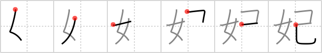

## `queen`

## [6]

## Reading:

### On-Yomi: ヒ &mdash; Kun-Yomi: きさき

## Heisig V6:

Woman . . . snake.

## Koohii stories:

1) [<a href="http://kanji.koohii.com/profile/synewave">synewave</a>] 17-2-2007(233): Cleopatra.

2) [<a href="http://kanji.koohii.com/profile/DrWarrior12">DrWarrior12</a>] 6-9-2007(145): Be careful you don&#039;t pick up a drag<strong> queen</strong> at a club - they might look like women, but they have a snake down there!

3) [<a href="http://kanji.koohii.com/profile/rizzo">rizzo</a>] 20-10-2005(68): <strong>Queen</strong> Cleopatra ends her reign (and life) with the help of a <em>snake</em>.

4) [<a href="http://kanji.koohii.com/profile/darg_sama">darg_sama</a>] 9-10-2005(36): Medusa, the snake<strong> queen</strong>. She&#039;s the penultimate &quot;snake woman&quot;.

5) [<a href="http://kanji.koohii.com/profile/Daffydus">Daffydus</a>] 17-7-2009(24): A<strong> queen</strong> is a woman who only thinks about her <a href="../525">self</a> (#525 己).

6) [<a href="http://kanji.koohii.com/profile/rgravina">rgravina</a>] 4-7-2007(14): A <em>snake</em>-like <em>woman</em> makes an effective<strong> queen</strong>.

7) [<a href="http://kanji.koohii.com/profile/bchallenor">bchallenor</a>] 9-9-2009(12): <strong>QUEEN</strong> Cleopatra is the <em>woman</em> who killed her<em>self</em> with a <em>snake</em>.

8) [<a href="http://kanji.koohii.com/profile/PacifistGod">PacifistGod</a>] 8-4-2007(7): A<strong> queen</strong> is a woman with a snake [between his/her legs]. Note:<strong> Queen</strong> is a term for a male crossdresser.

9) [<a href="http://kanji.koohii.com/profile/gavin.schultz-ohkubo">gavin.schultz-ohkubo</a>] 6-5-2010(6): Following liosama&#039;s suggestion of &quot;sperm&quot; for 己 <a href="../525">self</a> (#525 己): Think of an ant or bee colony, where the<strong> queen</strong> hoards all the male <em>sperm</em> and uses it over many years (true!). Thus the<strong> queen</strong> is quite literally a &quot;<em>woman</em> of <em>sperm</em>&quot;.

10) [<a href="http://kanji.koohii.com/profile/Lazerbeat">Lazerbeat</a>] 30-10-2011(4): <strong>Queen</strong> cleopatra, a WOMAN with a great ASP.
