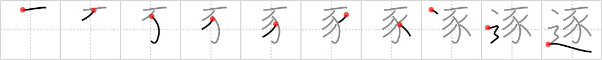

## `pursue`

## [10]

## Reading:

### On-Yomi: チク

## Heisig story:

Sows . . . road.

## Koohii stories:

1) [<a href="http://kanji.koohii.com/profile/vosmiura">vosmiura</a>] 30-5-2007(155): In association with <a href="../540">consummate</a> (#540 遂), our <em>sow</em> is on the road <strong>pursuing</strong> a mate.

2) [<a href="http://kanji.koohii.com/profile/samueruht">samueruht</a>] 19-1-2008(42): The <em>pig</em> is on the <em>road</em> in the<strong> pursue</strong> of the turtle who is trying to <a href="../283">escape</a> (#283 逃). (See story on <a href="../283">escape</a> (#283 逃) &amp; <a href="../540">consummate</a> (#540 遂)).

3) [<a href="http://kanji.koohii.com/profile/genbaku">genbaku</a>] 7-1-2008(40): In order to hunt for food one must<strong> pursue</strong> the fat sow on the road.

4) [<a href="http://kanji.koohii.com/profile/dizzwave">dizzwave</a>] 15-5-2008(36): Miss Piggy, everybody&#039;s favorite <em>sow</em>, is hitting the <em>road</em> to<strong> pursue</strong> her long lost Kermit the frog.

5) [<a href="http://kanji.koohii.com/profile/laner36">laner36</a>] 11-7-2007(24): Think of cops (P.I.G.s) pursuing someone down the road. (e.g. a Ron Ronnie Run clip).

6) [<a href="http://kanji.koohii.com/profile/Danieru">Danieru</a>] 30-1-2008(15): In addition to the &#039;<strong>pursue</strong>&#039; (<strong>drive out</strong>) keyword that Heisig uses, the additional meaning of <strong>one by one</strong> (as in 逐次 ) is important. To reinforce both these meanings, imagine some cops (pigs?) <strong>pursuing</strong> <em>sows</em> down the road, driving them of their town out one by one.

7) [<a href="http://kanji.koohii.com/profile/stephan">stephan</a>] 12-10-2008(11): When Asterix and Obelix hunt <em>boars</em>, they <strong>pursue</strong> them <strong>one by one</strong>. When a boar has been <strong>driven out</strong> of the woods onto the forest <em>path</em>, it can easily be caught.

8) [<a href="http://kanji.koohii.com/profile/peepiceek">peepiceek</a>] 5-6-2008(10): In <strong>pursuit</strong> of dinner, the hunter followed the <em>path</em> of the <em>pig</em> through the wilderness.

9) [<a href="http://kanji.koohii.com/profile/PepeSeco">PepeSeco</a>] 11-9-2006(7): To<strong> pursue</strong> = to pur<em>sow</em> on the <em>road</em>.

10) [<a href="http://kanji.koohii.com/profile/munia">munia</a>] 18-9-2008(5): I<strong> pursue</strong> my goals the way a farmer would<strong> pursue</strong> a runaway <em>sow</em> down the <em>road</em>.
