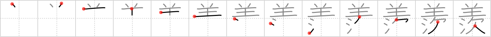

# {羨}

## `envious`

## Strokes: 13

## Reading:

### On-Yomi: セン、エン &mdash; Kun-Yomi: うらや.む、あまり

### Examples: 羨ましい (うらや.ましい), 羨む (うらや.む)

## Words:

羨ましい(うらやましい): envious, enviable

羨む(うらやむ): envy
