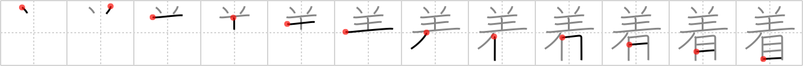

## {555}

## `don`

## [12]

## Reading:

### On-Yomi: チャク、ジャク &mdash; Kun-Yomi: き.る、-ぎ、き.せる、-き.せ、つ.く、つ.ける

### Examples: 着用 (ちゃくよう), 着手 (ちゃくしゅ), 土着 (どちゃく), 着せる (き.せる), 着る (き.る), 着く (つ.く), 着ける (つ.ける)

## Words:

落ち着き(おちつき): calm, composure

着飾る(きかざる): to dress up

執着(しゅうじゃく): attachment, adhesion, tenacity

先着(せんちゃく): first arrival

辿り着く(たどりつく): to grope along to, to struggle on to, to arrive somewhere after a struggle

着(ちゃく): counter for suits of clothing, arriving at ..

着手(ちゃくしゅ): embarkation, launch

着色(ちゃくしょく): colouring, coloring

着席(ちゃくせき): sit down, seat

着目(ちゃくもく): attention

着陸(ちゃくりく): landing, alighting, touch down

着工(ちゃっこう): start of (construction) work

着ける(つける): to arrive, to wear, to put on

落着く(おちつく): calm down, settle in, be steady

着替え(きがえ): changing clothes, change of clothes

着せる(きせる): put on clothes

着々(ちゃくちゃく): steadily

到着(とうちゃく): arrival

肌着(はだぎ): underwear, lingerie, singlet, chemise

着物(きもの): Japanese traditional dress

下着(したぎ): underwear

上着(うわぎ): coat, tunic, jacket, outer garment

着る(きる): to wear, put on (from shoulders down)

着く(つく): arrive at, reach
