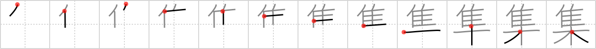

## {559}

## `gather`

## [12]

## Reading:

### On-Yomi: シュウ &mdash; Kun-Yomi: あつ.まる、あつ.める、つど.う

### Examples: 集まる (あつ.まる), 集める (あつ.める), 集う (つど.う)

## Words:

集まり(あつまり): gathering, meeting, assembly, collection

群集(ぐんしゅう): (social) group, crowd, throng, mob, multitude

採集(さいしゅう): collecting, gathering

集計(しゅうけい): totalization, aggregate

収集(しゅうしゅう): gathering up, collection, accumulation

特集(とくしゅう): feature (e.g. newspaper), special edition, report

密集(みっしゅう): crowd, close formation, dense

集会(しゅうかい): meeting, assembly

集金(しゅうきん): money collection

集合(しゅうごう): gathering, assembly, meeting, (mathematics) set

集団(しゅうだん): group, mass

集中(しゅうちゅう): concentration, focusing the mind

全集(ぜんしゅう): complete works

編集(へんしゅう): editing, compilation, editorial (e.g. committee)

募集(ぼしゅう): recruiting, taking applications

集まる(あつまる): gather

集める(あつめる): get (things) together
