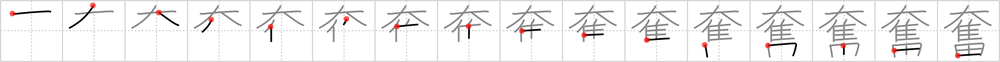

## `stirred up`

## [16]

## Reading:

### On-Yomi: フン &mdash; Kun-Yomi: ふる.う

### Examples: 奮う (ふる.う)

## Words:

興奮(こうふん): excitement, stimulation, agitation, arousal

奮闘(ふんとう): hard struggle, strenuous effort

## Koohii stories:

1) [<a href="http://kanji.koohii.com/profile/smithsonian">smithsonian</a>] 9-1-2007(241): The <em>St. Bernard dog</em> pounces on a <em>turkey</em> in a <em>rice field</em> and <strong>stirs up</strong> all the other birds around. See them all gobble gobbling in fear? 

2) [<a href="http://kanji.koohii.com/profile/elitentity">elitentity</a>] 5-2-2006(91): Gruesome, but it makes it easy to remember. Here goes: The <em>St. Bernard</em><strong> stirred up</strong> a crowd of <em>turkeys</em> and caught one. It bit the head, <em>brains</em> spilling onto the <em>rice field</em>. 

3) [<a href="http://kanji.koohii.com/profile/cameron_en">cameron_en</a>] 23-6-2008(47): Calling my brother/sister &quot;<em>big turkey brains</em>&quot; gets her real<strong> stirred up</strong>. 

4) [<a href="http://kanji.koohii.com/profile/jameserb">jameserb</a>] 12-1-2008(28): St. Bernard/Turkey/Field =<strong> Stirred up</strong>. The St. Bernard<strong> stirred up</strong> all the animals on the farm as he chased the turkey through the field. (He also<strong> stirred up</strong> a lot of dust). 

5) [<a href="http://kanji.koohii.com/profile/liosama">liosama</a>] 29-11-2008(22): BIG + TURKEY = &#039;Chocobo&#039; (For those final fantasy fans).<strong> Stirred up</strong> and excited are chocobos when you let them run around on a rice field in hope of finding gyshal greens. 

6) [<a href="http://kanji.koohii.com/profile/harusame">harusame</a>] 25-5-2009(10): The old witch<strong> stirred up</strong> a rather strange soup - <em>St. Bernard</em> with <em>turkey</em> and <em>brains</em>. 

7) [<a href="http://kanji.koohii.com/profile/raulir">raulir</a>] 25-4-2006(9): This kanji is related to <a href="../566">rob</a> (#566 <a href="http://jisho.org/kanji/details/奪">奪</a>). For some reason, a St. Bernard comes across a turkey on the rice fields. Of course, seeing game, the dog gets quite<strong> stirred up</strong>. Here we see the end result: the dog is on top of its prey, and the rice field is naturally below them both. 

8) [<a href="http://kanji.koohii.com/profile/losloriol">losloriol</a>] 22-8-2009(6): Grossest thing i can think of is BIG TURKEY BRAINS<strong> stirred up</strong> together. 

9) [<a href="http://kanji.koohii.com/profile/johngwk">johngwk</a>] 17-10-2010(5): Boy that <em>St. Bernard</em> is<strong> stirred up</strong>! He chased the <em>turkey</em> all over the <em>rice field</em>. 

10) [<a href="http://kanji.koohii.com/profile/Asriel">Asriel</a>] 14-3-2009(5): The whole town got<strong> stirred up</strong> when the <em>big turkey</em> started attacking every <em>rice field</em> in town. 
