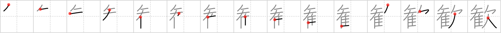

## `delight`

## [15]

## Reading:

### On-Yomi: カン &mdash; Kun-Yomi: よろこ.ぶ

## Heisig V6:

Again I cannot resist sharing my own associations. If you've ever seen Disney's animated interpretation of classical music, &quot;Fantasia,&quot; you will recall what was done there with Beethoven's &quot;Pastoral Symphony&quot; (the 6th), and the <i>flying horses</i> that figured in it. The mares are bathing in the stream and the stallions begin to gather. As dusk sets in, the <i>flying horses</i> all start <i>yawning</i> and pair off for the night: a perfectly <b>delightful</b> portrait of <b>delight</b>.

## Koohii stories:

1) [<a href="http://kanji.koohii.com/profile/mattoc_g">mattoc_g</a>] 20-4-2006(234): Imagine a spoiled little girl. Her<strong> delight</strong> when she gets a Pegasus for her birthday... and then like all spoilt little girls she gets bored of it quickly... hence the yawn.

2) [<a href="http://kanji.koohii.com/profile/ruisu">ruisu</a>] 2-11-2007(175): I would be<strong> delight</strong>ed if Japanese lacked the Pegasus kanji.

3) [<a href="http://kanji.koohii.com/profile/rich_f">rich_f</a>] 16-7-2007(67): A <em>lack</em> of <em>flying horses</em> is a <strong>delight</strong> to those on the ground who get hit with the <em>flying horse</em> poop.

4) [<a href="http://kanji.koohii.com/profile/uberclimber">uberclimber</a>] 27-3-2011(31): I would be<strong> delight</strong>ed to see an actual <em>pegasus</em>. The world <em>lack</em>s their kind, and is the poorer for it. 歓声 (かんせい) : cheer, shout of joy; 歓迎 (かんげい) : welcome, reception..

5) [<a href="http://kanji.koohii.com/profile/narafan">narafan</a>] 4-8-2007(19): Malfoy<strong> delight</strong>s in the lack of hippogriffs (pegasus).

6) [<a href="http://kanji.koohii.com/profile/tcjeff">tcjeff</a>] 8-6-2008(14): Let me tell you how I captured a <em>Pegasus</em>. Well, as you well know, a <em>Pegasus</em>&#039;s favorite drink is Sunny<strong> Delight</strong>, so I spiked some with a sleeping pill, and left it outside. Hiding behind a tree, I saw the <em>Pegasus</em> drink the Sunny<strong> Delight</strong>, and as soon as it <em>yawned</em> and fell asleep, I tied it up and brought it home. Imagine how<strong> delight</strong>ed I was with myself! Good think I knew how to make a <em>Pegasus yawn</em>.

7) [<a href="http://kanji.koohii.com/profile/thermal">thermal</a>] 17-5-2008(13): It is a<strong> DELIGHT</strong> to ride a PEGASUS, but for the PEGASUS itself it is boring. Look at that YAWN!

8) [<a href="http://kanji.koohii.com/profile/Ramchip">Ramchip</a>] 11-2-2008(10): The children are<strong> delight</strong>ed to see Pegasus!... but all the adults in the room are yawning. They know it&#039;s just a disguise.

9) [<a href="http://kanji.koohii.com/profile/Talonmalon">Talonmalon</a>] 21-3-2012(6): With <em> Pegasuses</em>, there is no <em>lack</em> of<strong> delight</strong>!

10) [<a href="http://kanji.koohii.com/profile/nesert">nesert</a>] 22-6-2010(5): This<strong> delight</strong>ful hybrid is the <em>Pegasus</em> -- a combination of a <em>horse</em> and a <em>turkey</em>. As a hybrid, it is sterile, <em>lack</em>ing fertility.
