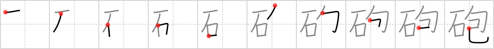

## `cannon`

## [10]

## Reading:

### On-Yomi: ホウ

## Heisig story:

Stones . . . wrap.

## Koohii stories:

1) [<a href="http://kanji.koohii.com/profile/calittle">calittle</a>] 22-9-2007(162): Primitive <strong>cannons</strong> fired <em>stones</em> <em>wrapped</em> with poisonous snakes.

2) [<a href="http://kanji.koohii.com/profile/dshill99">dshill99</a>] 23-4-2008(131): <strong>Cannon</strong> = <em>stone</em> projectile <em>wrapped</em> by a barrel.

3) [<a href="http://kanji.koohii.com/profile/pmbeddall">pmbeddall</a>] 25-10-2007(23): A <em>stone</em> <em>wrap</em>ped in smoke blazes from the mouth of a<strong> cannon</strong>.

4) [<a href="http://kanji.koohii.com/profile/fuaburisu">fuaburisu</a>] 10-10-2005(20): Picture a very powerful<strong> cannon</strong> (such as on pirate ships), only this one&#039;s on an island, and pointed at the sea. It&#039;s recoil had to be dealt with somehow, so it is placed in a tight-fitting alcove of <em>stone</em>. Hence &quot;<em>stone-wrapped</em><strong> cannon</strong>&quot;.

5) [<a href="http://kanji.koohii.com/profile/uberclimber">uberclimber</a>] 3-1-2011(16): Rather than a<strong> cannon</strong>, think of a catapult or trebuchet. Both these siege engines fire a large <em>stone</em> that is initially <em>wrapped</em> up or cradled in some fashion. 鉄砲 (てっぽう) : gun.

6) [<a href="http://kanji.koohii.com/profile/washburn1981">washburn1981</a>] 5-6-2010(7): Think of a <strong>cannon</strong> on an old wooden ship, firing chain shot: two <em>stones</em> connected by a chain, which would <em>wrap</em> itself around the mast of another ship.

7) [<a href="http://kanji.koohii.com/profile/mrgrimm">mrgrimm</a>] 10-2-2010(5): Early<strong> cannon</strong>s were really just <em>stones</em> that were <em>wrap</em>ed up together.

8) [<a href="http://kanji.koohii.com/profile/Django">Django</a>] 6-7-2012(2): This is the sort of<strong> cannon</strong> that might get used in a Monty Python film. At first its owners shoot <em>rocks</em> out of it and then, when they&#039;ve run out of those, start firing <em>snake wraps</em> at the enemy.

9) [<a href="http://kanji.koohii.com/profile/emichaelsen">emichaelsen</a>] 9-6-2012(2): A <em>bunch of stones wrapped up</em> together should suggest grapeshot in a Civil War<strong> cannon</strong>.

10) [<a href="http://kanji.koohii.com/profile/gfb345">gfb345</a>] 25-5-2010(2): The type of<strong> CANNON</strong> represented by 砲 is a primitive large-caliber bombard that fired <em>STONE</em>s <em>WRAPPED</em> in rags permeated with some incendiary and/or poisonous substance (e.g. quicklime, Greek fire, or a special recipe for poisonous gunpowder).
