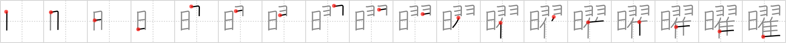

## `weekday`

## [18]

## Reading:

### On-Yomi: ヨウ

## Heisig V6:

Day . . . feathers . . . turkey.

## Koohii stories:

1) [<a href="http://kanji.koohii.com/profile/Katsuo">Katsuo</a>] 28-2-2008(327): Tip: <em>feathers</em> + <em>turkey</em> : This combination of primitives appears six times in Heisig, so it&#039;s worthwhile giving it a name. I suggest &quot;<em>futon</em>&quot; (your <em>futon</em> is made from <em>turkey feathers</em>). REF: <em>weekday</em> (FRAME 576) , <a href="../577">laundry</a> (#577 濯), <a href="../1285">leap</a> (#1285 躍), <a href="../2272">outstanding</a> (#2272 擢), <a href="../2534">twinkle</a> (#2534 燿), <a href="../2880">shimmering</a> (#2880 耀). Story: On<strong> weekday</strong>s you hang your <em>futon</em> out in the <em>sun</em>.

2) [<a href="http://kanji.koohii.com/profile/Howdoken">Howdoken</a>] 12-1-2008(77): The poor farmer spends every<strong> weekday</strong> while the <em>sun</em> shines, plucking <em>turkey</em> <em>feathers</em>.

3) [<a href="http://kanji.koohii.com/profile/zazen666">zazen666</a>] 30-8-2007(30): On the<strong> weekday</strong>s, turkeys have to go to work. What do they do at work? Well, just strut their feathers. (It&#039;s an easy gig.).

4) [<a href="http://kanji.koohii.com/profile/kathodos">kathodos</a>] 19-2-2009(19): I have a terrible job, on<strong> weekday</strong>s all I do all <em>day</em> is to pluck the <em>feathers</em> from <em>turkeys</em>. Its especially busy around christmas.

5) [<a href="http://kanji.koohii.com/profile/Asayoru">Asayoru</a>] 30-9-2010(10): Every <strong>day of the week</strong>, I let the <em>sun</em> shine on on my <em>futon</em> so it will be warm by bedtime.

6) [<a href="http://kanji.koohii.com/profile/munia">munia</a>] 1-11-2008(9): During the<strong> weekday</strong>s, while the <em>sun</em> is up, <em>turkey</em>s never play <em>yo-yo</em> (lest humans find out that <em>turkey</em>s can actually play <em>yo-yo</em>!). Note: I use <em>yo-yo</em> for the wings when they are depicted like the katakana ヨヨ (which is pronounced &quot;yo yo&quot;), to distinguish it from regular <em>wings</em>.

7) [<a href="http://kanji.koohii.com/profile/RoboTact">RoboTact</a>] 3-1-2007(5): Every week<em>day</em> paultry factory worker plucks the <em>turkeys</em>.

8) [<a href="http://kanji.koohii.com/profile/fuaburisu">fuaburisu</a>] 20-1-2006(5): Every <em>day</em>, the <em>old turkey</em> leaves a <em>couple feathers</em> for the children to play “cowboy and indians”. Every<strong> weekday</strong>, that is. Thus -- &quot;weekdays are days when the old turkey leaves a couple feathers&quot; (I often imagined the <em>old turkey</em> as a house pet, almost a family member, rather than a generic turkey).

9) [<a href="http://kanji.koohii.com/profile/Virtua_Leaf">Virtua_Leaf</a>] 18-9-2009(4): I dread the <em>sun</em> coming up every<strong> weekday</strong>. I&#039;d rather just stay in my <em>futon</em>.

10) [<a href="http://kanji.koohii.com/profile/Spidercat">Spidercat</a>] 5-12-2007(4): <strong>Weekday</strong>s are the <em>days</em> you can see <em>turkeys</em> going to work. They don&#039;t use cars like we do, they use their <em>feathers</em> (wings).
