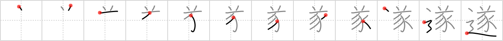

## `consummate`

## [12]

## Reading:

### On-Yomi: スイ &mdash; Kun-Yomi: と.げる、つい.に

## Heisig story:

The <i>horns</i> atop the <i>sow</i> suggest a boar at work in the background. Add the element for a <i>road</i>. Now create a story whose meaning is: <b>consummate</b>.

## Koohii stories:

1) [<a href="http://kanji.koohii.com/profile/rizzo">rizzo</a>] 20-10-2005(173): This is still Miss Piggy only she&#039;s gotten <em>horny</em> (as she often does) and now she&#039;s <em>pursuing</em> Kermit to help her<strong> consummate</strong> her desires.

2) [<a href="http://kanji.koohii.com/profile/Danieru">Danieru</a>] 30-6-2008(74): I don&#039;t often complain about Heisig&#039;s keywords - but &#039;consummate&#039; is a little misleading. Think about this kanji in terms of <strong>ACCOMPLISH</strong> or &quot;realize&quot; rather than a sexual encounter. Or, combine the two: the policemen thought they had <strong>accomplished</strong> the task of <em>driving out</em> (see <strong>pursue</strong>, last frame) all the <em>sows</em>, but they received a phone call reporting two <em>horny</em> pigs <strong>CONSUMMATING</strong> on a <em>road</em>. When they got there, they found a male and female police officer, not pigs!

3) [<a href="http://kanji.koohii.com/profile/vosmiura">vosmiura</a>] 30-5-2007(73): In association with <a href="../539">pursue</a> (#539 逐), our <em>sow</em> has tracked down a suitable mate, they&#039;ve<strong> consummate</strong>d their relationship, and now the <em>little sow</em> is all grown up into a <em>boar</em> with horns.

4) [<a href="http://kanji.koohii.com/profile/noushina">noushina</a>] 19-1-2007(33): The Horny Pig<strong> Consummate</strong>s in the middle of the Road.

5) [<a href="http://kanji.koohii.com/profile/samueruht">samueruht</a>] 19-1-2008(16): The turtle promised to marry the pig, but after some second thoughts the turtle is on the road trying to <a href="../283">escape</a> (#283 逃) and the pig is on the <a href="../539">pursue</a> (#539 逐). We end up with a <em>horn</em>y <em>pursue</em>r trying to<strong> consummate</strong> the matrimony.

6) [<a href="http://kanji.koohii.com/profile/Wosret">Wosret</a>] 29-5-2008(11): The horny sows<strong> consummate</strong> their relationship right in the middle of the road!

7) [<a href="http://kanji.koohii.com/profile/stephan">stephan</a>] 12-10-2008(10): When the hunt (see <a href="../539">pursue</a> (#539 逐)) is <strong>accomplished</strong>, we see Obelix with his <em>horned</em> Gaul helmet, overlooking the dead <em>boar</em> lying on the forest <em>path</em>. Used in 完遂 (accomplish), 未遂 (attempt [at a crime]). Heisig&#039;s key word choice is a bit strange here.

8) [<a href="http://kanji.koohii.com/profile/wholefnfro">wholefnfro</a>] 22-4-2008(7): <strong>Consummate</strong> = horny pursuit.

9) [<a href="http://kanji.koohii.com/profile/Hinsoog">Hinsoog</a>] 3-1-2012(4): In Medieval hunting, boars(<em>sow</em> with <em>horns</em>) were a prestigious quarry. The <em>road</em> to becoming a<strong> consummate</strong> hunter is filled with successful boar hunting.

10) [<a href="http://kanji.koohii.com/profile/dvknoke">dvknoke</a>] 7-6-2010(4): Now we see the real reason for Ms. <em>Sow</em>&#039;s pursuit--her <em>horn</em>iness. So she is <em>pursuing</em> after handsome Mr. Boar in order to<strong> consummate</strong> her desire.
