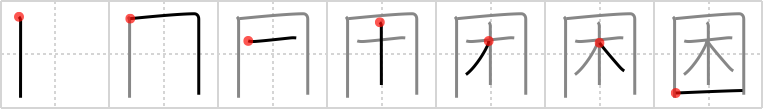

# {困}

## Strokes: 7

## Reading:

### On-Yomi: コン &mdash; Kun-Yomi: こま.る

### Examples: 困る (こま.る)

## Words:

貧困(ひんこん): poverty, lack

困難(こんなん): difficulty, distress

困る(こまる): be troubled, be worried, be bothered
