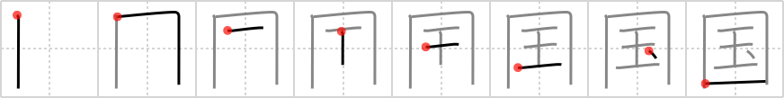

## `country`

## [8]

## Reading:

### On-Yomi: コク &mdash; Kun-Yomi: くに

## Koohii stories:

1) [<a href="http://kanji.koohii.com/profile/Howdoken">Howdoken</a>] 12-1-2008(127): In my<strong> country</strong> (England) the crown <em>jewels</em> are kept <em>pent-in</em> in the Tower of London. Which happens to be where enemies of the state were once also <em>pent-in</em> (probably for trying to steal those <em>jewels</em>). 

2) [<a href="http://kanji.koohii.com/profile/genbaku">genbaku</a>] 11-1-2008(95): Just think of Japan, a<strong> country</strong> which is like a jewel but historically very enclosed. 

3) [<a href="http://kanji.koohii.com/profile/fuaburisu">fuaburisu</a>] 21-10-2005(30): Think of a<strong> country</strong> that has “<em>pent in</em>” all of its <em>jewels</em> so they wouldn&#039;t go away. Maybe it was China and its great wall. 

4) [<a href="http://kanji.koohii.com/profile/ajikanji">ajikanji</a>] 17-4-2008(24): Japan was once a<strong> COUNTRY</strong> that went through a period of isolationism; it&#039;s JEWELS were PENT-IN and could not be traded. 

5) [<a href="http://kanji.koohii.com/profile/skellyfish">skellyfish</a>] 13-2-2009(12): Picture a map of the world showing all the different <strong>countries</strong> PENT IN with thick borders, each one with an image of a pile of JEWELS proportional to its wealth (like those cute little geography maps from elementary school). 

6) [<a href="http://kanji.koohii.com/profile/darg_sama">darg_sama</a>] 9-10-2005(10): The<strong> country</strong>&#039;s national treasure, in this specific case England&#039;s, happens to be the crown jewels, which are kept pent up in some tower somewhere safe from everyone. 

7) [<a href="http://kanji.koohii.com/profile/cameron_en">cameron_en</a>] 24-6-2008(9): In the olden days, <strong>countries</strong> keep their <em>jewels</em> <em>pent in</em>. These days we&#039;re more open to trade. 

8) [<a href="http://kanji.koohii.com/profile/vashbandy">vashbandy</a>] 12-12-2009(8): Try Switzerland if you need a<strong> country</strong> to <em>box</em> your <em>jewels</em>. It&#039;s what all the other countries are doing. 

9) [<a href="http://kanji.koohii.com/profile/killtheclock">killtheclock</a>] 2-2-2009(4): Patrioten hüten ihr <strong>Land</strong> wie einen <em>Edelstein</em> und <em>zäunen</em> es dazu gut <em>ein</em>. 

10) [<a href="http://kanji.koohii.com/profile/kansaigaijin">kansaigaijin</a>] 11-1-2009(4): England is a <strong>country</strong> that is famous for its <em>jewels</em> <em>pent in</em> the Tower of London. 
