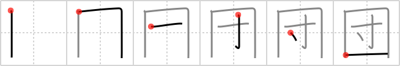

# {団}

## Strokes: 6

## Reading:

### On-Yomi: ダン、トン &mdash; Kun-Yomi: かたまり、まる.い

### Examples: 団結 (だんけつ), 団地 (だんち), 集団 (しゅうだん)

## Words:

団扇(うちわ): fan

劇団(げきだん): troupe, theatrical company

公団(こうだん): public corporation

団結(だんけつ): unity, union, combination

座布団(ざぶとん): cushion (Japanese-- square cushion used when sitting on one´s knees on a tatami-mat floor)

集団(しゅうだん): group, mass

団体(だんたい): party of tourists

団地(だんち): multi-unit apartments

布団(ふとん): futon
