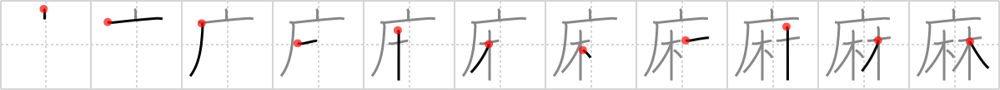

## `hemp`

## [11]

## Reading:

### On-Yomi: マ、マア &mdash; Kun-Yomi: あさ

## Heisig story:

<i>Cave</i> . . . <i>grove</i>. If it helps, this is the <b>hemp</b> marijuana comes from.

## Koohii stories:

1) [<a href="http://kanji.koohii.com/profile/dingomick">dingomick</a>] 15-2-2007(135): (Image: while Batman is out, Robin is smokin&#039; a huge doob in a secret corner of the Bat<em>cave</em> where he nurtures his<strong> hemp</strong> <em>grove</em>).

2) [<a href="http://kanji.koohii.com/profile/madheavy">madheavy</a>] 30-1-2008(110): Where is the best place to hid your <em>grove</em> of<strong> hemp</strong> trees? In a cave, you <em>dope</em>!

3) [<a href="http://kanji.koohii.com/profile/calittle">calittle</a>] 23-9-2007(45): The world&#039;s most prolific drug dealer maintains a massive <em>grove</em> of<strong> hemp</strong> in a <em>cave</em> to avoid law enforcement.

4) [<a href="http://kanji.koohii.com/profile/harusame">harusame</a>] 19-5-2009(35): <strong>Hemp</strong> is an extremely useful material and can be used to make produce healthy oils (such as omega-3 and 6), fibers for clothing, biomass for fuel and even sturdy industrial matierals. (All of this is true.) Unfortunately, because the USDEA is run by a bunch of morons that refuse to distinguish between it and marijuana, you can&#039;t get a permit to grow it and thus have to grow your<strong> hemp</strong> groves in a cave to avoid fines and prosecution.

5) [<a href="http://kanji.koohii.com/profile/osaki">osaki</a>] 8-5-2007(13): The<strong> hemp</strong> grove is in the cave.

6) [<a href="http://kanji.koohii.com/profile/eri401">eri401</a>] 10-6-2009(9): When you look at your <a href="../592">bed</a> (#592 床) and see double, it means you are way too high on<strong> hemp</strong>. If you 磨 <a href="../594">grind</a> (#594 磨) the 麻 <a href="../593">hemp</a> (#593 麻) without a stone but use your <em>hand</em> instead it will 摩 <a href="../639">chafe</a> (#639 摩).

7) [<a href="http://kanji.koohii.com/profile/jinkouchinou">jinkouchinou</a>] 12-6-2009(8): Drug lords are growing their <em>groves</em> of<strong> hemp</strong> in <em>caves</em> now so that they cannot be spotted by satellites.

8) [<a href="http://kanji.koohii.com/profile/flameiguana">flameiguana</a>] 1-9-2012(5): Growing<strong> hemp</strong> is illegal, so they kept their <em>grove</em> in a <em>cave</em> where no one would know about it.

9) [<a href="http://kanji.koohii.com/profile/killtheclock">killtheclock</a>] 3-2-2009(5): Meinen kleinen <em>Hain</em> von <strong>Hanf</strong>-Pflanzen verstecke ich lieber in einer <em>Höhle</em>.

10) [<a href="http://kanji.koohii.com/profile/kirkaking">kirkaking</a>] 28-6-2012(3): I have a <em>grove</em> of<strong> hemp</strong> growing secretly in a <em>cave</em>.
