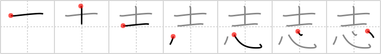

## `intention`

## [7]

## Reading:

### On-Yomi: シ、シリング &mdash; Kun-Yomi: こころざ.す、こころざし

### Examples: 志す (こころざ.す), 志 (こころざし)

## Words:

志(こころざし): will, intention, motive

志す(こころざす): to plan, to intend, to aspire to, to set aims (sights on)

志向(しこう): intention, aim

志望(しぼう): wish, desire, ambition

同志(どうし): same mind, comrade, kindred soul

意志(いし): will, volition

## Koohii stories:

1) [<a href="http://kanji.koohii.com/profile/narafan">narafan</a>] 25-7-2007(293): A <em>samurai&#039;</em>s <strong>intentions</strong> always come from the <em>heart</em>. 

2) [<a href="http://kanji.koohii.com/profile/amthomas">amthomas</a>] 17-1-2007(107): <em>Gentleman</em> always have <em>hearts</em> full of good<strong> intention</strong>s. 

3) [<a href="http://kanji.koohii.com/profile/dihutenosa">dihutenosa</a>] 1-9-2007(42): <em>Tom Cruise</em> no doubt had good<strong> intention</strong>s when he made the Last <em>Samurai</em> - his heart in the right place (right there, down to earth). Too bad the concept of a white dude as the last samurai is ridiculous, if not offensive. Picture Tom Cruise in a press conference being asked about this, at which point he jumps on a heart-shaped, grabs somebody&#039;s hands, and screams BUT MY<strong> INTENTION</strong>S WERE FROM THE HEART! SCIENTOLOGY HELPS PEOPLE. 

4) [<a href="http://kanji.koohii.com/profile/wazato">wazato</a>] 3-10-2007(29): A samurai shows up at the door to pick up his date. Her father asks, &quot;What are your<strong> intention</strong>s with my daughter?&quot; He responds that his<strong> intention</strong>s come from the heart. 

5) [<a href="http://kanji.koohii.com/profile/nekoyaki">nekoyaki</a>] 9-4-2009(19): Father: &quot;What are your<strong> intention</strong>s to my daughter?&quot;. <em>Samurai</em>: &quot;I intend to give her my <em>heart</em>! (slices out his own heart and hands it over). 

6) [<a href="http://kanji.koohii.com/profile/kanjihito">kanjihito</a>] 26-2-2011(8): Trained in zen, the <em>samurai</em> and his <em>heart</em> always share the same<strong> intention</strong>. 

7) [<a href="http://kanji.koohii.com/profile/norton">norton</a>] 24-6-2012(4): Suddenly a big <em>samurai</em> appears in front of you. Your <em>heart</em> starts to beat super fast and the only thing on your mind is the question whether his<strong> intention</strong>s are good or not. 

8) [<a href="http://kanji.koohii.com/profile/scotty28">scotty28</a>] 23-1-2010(4): A japanese father asks you&quot;what are your<strong> intention</strong>s towards my daughter?&quot; You reply&quot; Don&#039;t worry, my<strong> intention</strong>s are like the heart of an honourable samarai&quot;. 

9) [<a href="http://kanji.koohii.com/profile/caeliean">caeliean</a>] 1-8-2008(4): A <em>bushi</em>&#039;s <em>heart</em> is, by definition, filled with the<strong> intention</strong> of serving his lord. He must always place <em>bushi</em>do above his <em>heart</em>, family etc... 

10) [<a href="http://kanji.koohii.com/profile/jinkouchinou">jinkouchinou</a>] 12-6-2009(3): A <em>samurai</em>&#039;s<strong> intention</strong>s cannot be influenced by evils because the code of   <a href="http://jisho.org/kanji/details/武士道">武士道</a>   is firmly instilled in his <em>heart</em>. 
